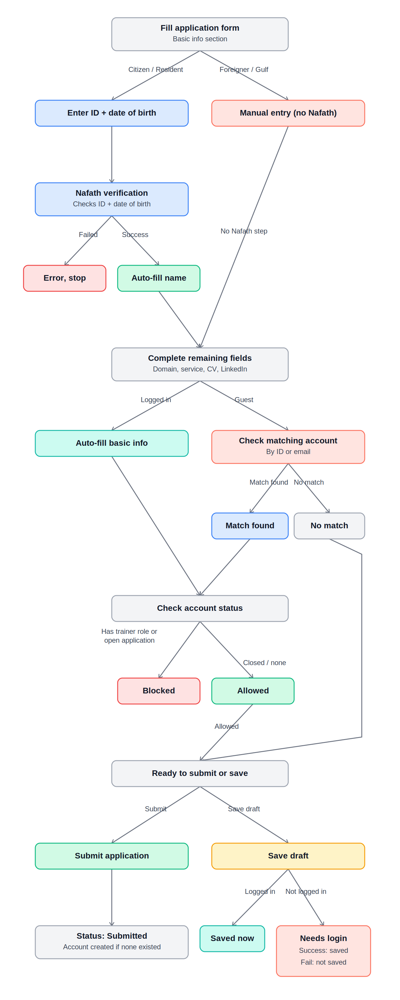

# J-01: Initial Onboarding & Application Submission

> ⚠️ **Amended 2026-09-02 by owner ruling (`P-201`).** Everywhere this journey
> says **نفاذ / Nafath**, read **يقين / Yaqeen** — and the verification is
> reached **through FAST**, not as a direct integration with the provider.
> «nafath is using yaqen not nafath and it's from fast also». The product's
> identity screens were renamed the same day; the journey text below is left
> as written so the change is visible rather than silent.

Name (Ar): الانضمام الأولي وتقديم الطلب

### **Journey Scope:**

Covers identity verification, account resolution, form completion, draft handling, and submission. Ends once the application is confirmed and queued for screening.

### **Interface:**

Trainer Portal, Public Interface

## **User Flow**

1. Applicant's identity/account is resolved (per Identity Linking Rules)
2. Applicant completes Section 1 (Basic Information) — always mandatory
3. Applicant completes Sections 2–6 sequentially, per mandatory status for selected service(s)
4. Each section is validated before moving to the next (no skipping incomplete sections)
5. Applicant chooses: Save Draft or Submit
6. On submission, a reference number is generated and permanently linked to the application
7. Applicant receives submission confirmation (in-app + notification)
8. Application enters the screening queue

---

## Identity Linking

### Flow Diagram

### Rules & Logic

**Related Journey:** J-01 — Initial Onboarding & Application Submission
**Type:** Supporting Rule Set (not a feature — applies as a prerequisite layer before form completion begins)
**Owning Capability:** CAP-01 — Application Management

---

## 1. Purpose

Before an applicant can complete the application form, the platform must resolve two independent questions:

1. **Who is this person?** (identity verification)
2. **Do they already have an account or application?** (account resolution)

This document defines the rules governing both, so any reader — business or technical — understands how identity linking works without needing the full step-by-step screen sequence.

---

## 2. Layers Involved

| Layer | Role |
| --- | --- |
| **User** | Enters identity data, chooses ID type, initiates verification |
| **Platform** | Displays fields, applies matching logic, enforces access rules |
| **Nafath** | External government verification service (citizens/residents only) |
| **FA.Auth** | The Academy's identity/account system — source of truth for existing accounts |

---

## 3. Two Independent Decision Paths

### A. Identity Verification Path (based on ID type)

| ID Type | Verification Method | Behavior |
| --- | --- | --- |
| Citizen / Resident | **Nafath** | National ID + DOB submitted → Nafath verifies → success auto-fills name (and trusted fields); failure blocks progress with a clear error |
| Foreigner / Gulf (GCC) | **Manual** | No Nafath call exists for this category. Passport/GCC ID + DOB + all fields entered manually |

### B. Account Resolution Path (based on login state)

| State | Behavior |
| --- | --- |
| **Logged in** | Basic info auto-fills from the authenticated account directly — no matching needed |
| **Guest, matched via Nafath** (citizen/resident only) | Once Nafath succeeds, the platform silently checks for an existing FA.Auth account tied to that identity, and links to it if found |
| **Guest, foreigner/Gulf** | No real-time matching possible (no Nafath). Matching only happens **at submission**, via email |
| **Guest, no match found** (either path) | Treated as guest throughout the form; account is auto-provisioned only at submission |

---

## 4. Governing Rules

1. **One person = one Base Profile, always.** Identity linking exists to enforce this — no duplicate Base Profiles for the same individual (supports BR-0101, BR-0102).
2. **Draft saving always requires a resolved account.** A guest can fill the form, but cannot save a draft until logged in / account created. If account creation fails, the draft is not saved. Once saved, the draft persists **indefinitely** (no expiry) and stays linked 1:1 to that account.
3. **Verification ≠ Eligibility.** Nafath (or manual entry for foreigners) only confirms identity. Whether the person is *allowed* to proceed with a new application is a separate check, based on account status (see Edge Cases below).
4. **Matching happens once, early enough to block duplicates before effort is wasted** — citizens/residents are matched right after Nafath succeeds; foreigners/Gulf are matched only at submission (since no live verification service exists for them).

---

## 5. Edge Cases — Final Decision Table

| Scenario | Decision |
| --- | --- |
| Nafath verification fails (ID/DOB mismatch) | Block progress; show clear error until corrected |
| Matched account already has an active **Trainer role** | Block new application; redirect to existing Trainer Portal to add a service instead (→ J-03, not a new J-01 submission) |
| Matched account has an **open/active application** | Block new application; notify user, let them track the existing one from their portal |
| Matched account's previous application is **closed** (rejected/expired) | Allow new application; auto-fill basic data as usual |
| **No matching account found** | Treated as guest through the form; account auto-provisioned only at submission, then linked |
| **Save Draft** attempted (any identity type, not logged in) | Always redirected to login/account creation first; success → draft saved & linked (no expiry); failure → draft not saved |
| Foreigner/Gulf account matching | Only checked at submission, via email (no Nafath path exists for this category) |

---

## Key Features & Functionality

### **F1. Application Form Completion**

**Description:** Applicant completes the 6-section form; Section 1 is always mandatory, Sections 2–6 follow the Application Fields by Service matrix. Sections must be completed sequentially, with validation enforced at field and attachment level.

---

## Acceptance Criteria

| AC ID | Acceptance Criteria |
| --- | --- |
| AC-1 | Given Section 1 is submitted with one or more service types, then Sections 2–6 apply mandatory/optional status per the Application Fields by Service matrix |
| AC-2 | Given more than one service is selected, then a section is mandatory if mandatory for at least one selected service *(BR-0104)* |
| AC-3 | Given the current section has incomplete mandatory fields, when the applicant tries to move to the next section, then navigation is blocked until the current section is complete |
| AC-4 | Given any mandatory field/attachment is missing at final review, when the applicant tries to submit, then the system blocks submission and highlights missing items *(BR-0105)* |
| AC-5 | Given an attachment is uploaded, when the upload completes, then format and size are validated immediately against the configured rule for that attachment type; invalid files are rejected with a clear message. |
| AC-6 | Given fields with a defined format (email, URL, National ID/Iqama/Passport routing, date), when the applicant enters invalid data, then the field is flagged and blocks progress until corrected |

---

## **Supporting Matrix: Application Fields by Service** *(placeholder, pending)*

| Section | Trainer | Consultant | Content Developer | Question Writer |
| --- | --- | --- | --- | --- |
| 2. Educational Qualifications | ? | ? | ? | ? |
| 3. Professional Certifications | ? | ? | ? | ? |
| 4. Practical Experience | ? | ? | ? | ? |
| 5. Training Experience & Content | ? | ? | ? | ? |
| 6. Availability & Readiness | ? | ? | ? | ? |

---

## **Attachment Validation Rules**

| Attachment Type | Accepted Formats | Max Size |
| --- | --- | --- |
| Image | JPG, PNG | 1 MB |
| Any other document attachment (default) | PDF, DOC, DOCX | 1 MB |

### **F2. Draft Saving**

Description: Applicant saves incomplete progress to their account dashboard. No expiry — the draft remains available until submitted.

| AC ID | Acceptance Criteria |
| --- | --- |
| AC-1 | Given a resolved account, when the applicant saves a draft, then it is stored in the applicant's account dashboard, accessible anytime to resume |
| AC-2 | Given a saved draft, then it has no expiry date — it persists indefinitely until submitted |
| AC-3 | Given a draft exists, then it is linked 1:1 to the applicant's account — one draft/application per person, consistent with the one-active-application rule *(BR-0101)* |

### **F3. Submission & Confirmation**

Description: Applicant submits the completed application; a reference number is generated and permanently linked to it, and platform-wide submission-blocking rules are enforced.

| AC ID | Acceptance Criteria |
| --- | --- |
| AC-1 | Given a completed application, when the applicant submits, then it is locked from further edits and enters the screening queue |
| AC-2 | Given submission succeeds, then a unique reference number is generated **at that moment only** (not at draft stage) and permanently linked to the application record *(BR-0107)* |
| AC-3 | Given a person already has an active application not yet decided (accept/reject), across **any** service, then a new submission is blocked platform-wide *(BR-0101 — "open application" rule)* |
| AC-4 | Given a person's matched account already holds an active, approved Trainer role, then full re-submission via this journey is blocked; they are redirected to add a new service via their existing Trainer Portal instead *(per Identity Linking edge cases — this is the "Add Service" path, J-03, not a duplicate J-01 submission)* |