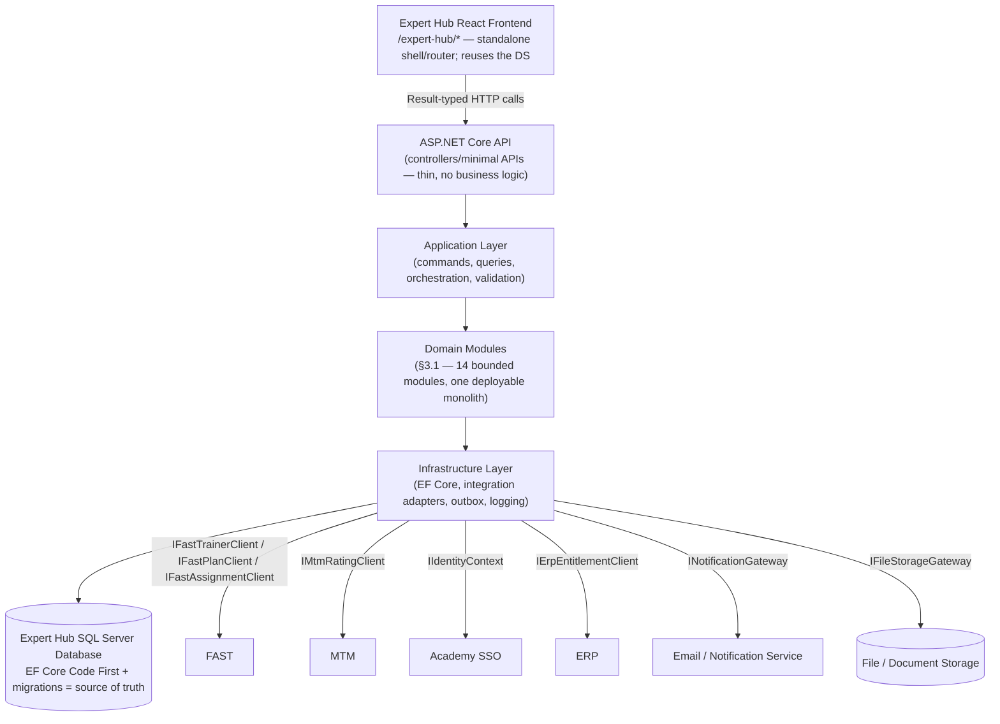

# 02C — Application & Integration Architecture

**Platform:** Expert & Independent Trainer Management Platform ("Expert Hub") — Financial Academy
**Status:** ✅ Complete (architecture-only — **no frontend/backend code in this session, no Design System changes**)
**Business baseline:** `BRD-TRN-001 v1.0` + all existing `docs/*` documentation
**Supersedes/extends:** `EXPERT_HUB_PRODUCT_AND_REPOSITORY_PLAN.md` §8A (Hybrid Data Architecture) — this document is the master architecture reference going forward; §8A remains valid and is cross-referenced, not duplicated, where content is unchanged.
**Decisions baseline:** `DECISIONS.md` `P-01`–`P-11` (see §14 of this document for the new entries added here)
**Date:** 2026-07-22

> **Scope discipline, same as every prior document in this set:** this is architecture — module boundaries, ownership, contracts, governance. No OpenAPI spec, no physical ERD, no wireframes, no code. Where a detail cannot be verified against the BRD or existing repository evidence, it is marked **Open API-contract question**, never invented as fact.

---

## ⚠️ Read this first: two identity/scope flags carried into this document

1. **Trainer-profile data ownership (FAST vs. Expert Hub).** `EXPERT_HUB_PRODUCT_AND_REPOSITORY_PLAN.md` §8A.11 flagged that the BRD's own text (`§8.4.1`: CAP-04 self-declares as *"the sole source of truth about the accredited trainer"*; `§8.12.4`'s source-of-truth matrix names Expert Hub, not FAST, as owner) conflicts with the hybrid-architecture instruction that assigns FAST ownership of trainer core profile/experience/roles/specializations/classification. **This document's instruction reaffirms the FAST-ownership position a second time, now with concrete technical detail (Plan ID, Plan Date, Program Name — consistent with genuine familiarity with the existing FAST schema).** Per the standing instruction to treat Product Owner statements as the approved baseline, this reaffirmation is now treated as **settled** (`G18`/`G22`/`G23` move from "Decision Required" to "Resolved by Product Owner reaffirmation, 2026-07-22" — see §4 and `DECISIONS.md` `P-11`). The BRD's differing language is preserved as a **permanent historical note**, not re-litigated further, and not treated as a blocker.
2. ~~**MTM has never appeared before this session.**~~ It was not named anywhere in `BRD-TRN-001 v1.0`, nor in any `docs/*` file prior to this document. The BRD's closest concept was **INT-02, "نظام تقييمات المتدربين" (Trainer Evaluation System)** — CAP-04 §8.4.4 describes "Trainer Evaluations" sourced from that system via integration. ~~Whether MTM *is* INT-02 or a distinct, previously-unscoped system was an open question.~~ **✅ Resolved 2026-07-22 (`DECISIONS.md` `P-13`): MTM is confirmed to be BRD's INT-02** — a real, distinct system, not a second integration alongside it. See §6 and `TODO.md` `Q15` (closed).
3. **(Added 2026-07-22) MTM's role was corrected the session after this document was written.** §4/§6/§7 originally said MTM was authoritative for the *final* rating values. That's now corrected in `02D_RATING_DATA_AND_CALCULATION_ARCHITECTURE.md`: **MTM is authoritative only for raw rating data; Expert Hub calculates and is authoritative for the program/overall rating indicators actually displayed.** Every section below carries an inline correction note pointing to `02D` — this document is not fully rewritten in place so the correction itself stays visible and traceable, per this documentation set's established practice.
4. **(Added 2026-07-22, third same-day update) MTM/INT-02 identity closed.** Flag #2 above is now resolved. Every remaining "Trainer Evaluation System"/"Trainee Evaluation System" reference to INT-02 in this document (§4, §6 opening note, §14, §15) is corrected to reflect the confirmed identity — search this document for `P-13` to find each one.

---

## Table of Contents

1. [Approved Technology Stack](#1-approved-technology-stack)
2. [Database Governance](#2-database-governance)
3. [Target Application Architecture](#3-target-application-architecture)
4. [Data Ownership Model](#4-data-ownership-model)
5. [FAST Integration Touchpoints](#5-fast-integration-touchpoints)
6. [MTM Rating Integration](#6-mtm-rating-integration)
7. [Rating Data Display Rules](#7-rating-data-display-rules)
8. [Integration Layer Design](#8-integration-layer-design)
9. [API Design Boundaries](#9-api-design-boundaries)
10. [Event and Synchronization Model](#10-event-and-synchronization-model)
11. [SQL Server Data Model Boundaries](#11-sql-server-data-model-boundaries)
12. [Security and Authorization](#12-security-and-authorization)
13. [Environments and Configuration](#13-environments-and-configuration)
14. [Decisions Added Here](#14-decisions-added-here)
15. [Readiness Assessment](#15-readiness-assessment)

---

## 1. Approved Technology Stack

### Frontend (reaffirms existing repository conventions — nothing new)
- Existing React frontend repository (`frontend/`), existing approved Design System (`frontend/src/design-system/`), existing application shell and routing infrastructure (`frontend/src/app/router/`).
- Expert Hub implemented under the locked `/expert-hub/*` namespace (`P-02`).
- No duplicate Design System components (`P-07`). Application-specific patterns stay outside the Design System (`02_INFORMATION_ARCHITECTURE.md` §9).

### Backend (new — approved this session)
- **ASP.NET Core Web API.**
- **Modular monolith** as the initial architecture — one deployable service, internally organized into clearly bounded domain modules (§3).
- **API-first** communication with the frontend and all external systems — no direct DB access from the frontend, no direct DB access from external systems into Expert Hub's database.
- Architecture must **support future extraction** of a module into its own service if warranted later — module boundaries (§3) are drawn so that extraction is a deployment change, not a redesign.

### Database (new — approved this session)
- **Microsoft SQL Server.**
- SSMS may be used for **administration and inspection only** (see §2 — this is the single most important governance rule in this document).
- **Entity Framework Core, Code First**, with **version-controlled EF Core migrations**.
- The **application repository and its migrations are the sole source of truth** for the Expert Hub schema. Manually created/altered production tables are never authoritative.

These are recorded as formal decisions `P-09` (stack) and `P-10` (governance) — see §14.

---

## 2. Database Governance

**Core rule:** SSMS is an **administration and inspection tool** — for query troubleshooting, performance investigation, ad hoc read-only diagnostics. It is **not** the schema-design or schema-change mechanism. Every rule below exists to keep that distinction unambiguous under deadline pressure, when "just add a column in SSMS" is most tempting and most damaging.

| # | Rule |
|---|---|
| 1 | Every Expert Hub table is represented in application code (EF Core entity + configuration) — no table without a corresponding C# model. |
| 2 | Every schema change ships as an EF Core migration — no schema change without one. |
| 3 | Migrations are committed to source control alongside the code that depends on them, in the same PR/commit where practical. |
| 4 | Database changes deploy through the CI/CD pipeline (`dotnet ef database update` or equivalent, run by the pipeline, not by hand). |
| 5 | Manual production database changes are **prohibited**, except approved emergency remediation (e.g. an incident requiring an immediate data fix). |
| 6 | Emergency changes must be reconciled back into code and migrations **within the same release cycle** — an emergency fix that never becomes a migration is a governance failure, not a closed incident. |
| 7 | Seed and reference data are managed through code (EF Core `HasData`/seeding) or controlled deployment scripts — never hand-inserted. |
| 8 | Schema versions are traceable to application releases (the migration history table **is** that traceability — do not build a parallel tracking mechanism). |
| 9 | Rollback and forward-fix strategy: **prefer forward-fix** (a new migration correcting the issue) over rollback for any migration that has touched production data; a true rollback (`Down()`) is reserved for migrations caught before a production deploy. Document this explicitly per migration when a `Down()` is intentionally a no-op (irreversible data migrations). |
| 10 | Audit fields use one consistent standard across every table: `CreatedAtUtc`, `CreatedBy`, `ModifiedAtUtc`, `ModifiedBy` at minimum, plus the immutable audit log (CAP-08) for sensitive actions specifically (`NFR-07`) — table-level audit columns and the audit log are complementary, not redundant (columns = "when was this row last touched," log = "what sensitive business action happened"). |
| 11 | Soft deletion vs. archival is defined **explicitly per entity**, not globally — e.g. an Application likely needs a full retained history (soft-delete/status-based, never hard-deleted, per `BR-1201`-style traceability expectations); a stale draft application may be eligible for hard deletion. This is finalized per-entity in `11_APPLICATIONS...` — no, correction: finalized per-entity in the future `10_DATABASE_DESIGN.md`, tracked now as open gap `G32` (unchanged from the Plan's §10.3). |
| 12 | Database naming conventions are documented before the first migration ships (PascalCase table/column names to match EF Core convention, `Id` PK suffix, FK as `<Entity>Id`, junction tables named `<EntityA><EntityB>`) — exact convention doc is a `07_FRONTEND_ARCHITECTURE.md`/future backend-equivalent-doc deliverable, not finalized here. |

---

## 3. Target Application Architecture

> **⚠️ Frontend note, corrected 2026-07-23 (`DECISIONS.md` `P-14`).** The Expert Hub **React frontend** is a **standalone application** (its own shell, router, layouts, auth boundary at `frontend/src/`), co-located with the Hackathon app only to reuse the Design System — it reuses the DS/tokens, **not** the Hackathon shell/routing/auth. The backend architecture below (ASP.NET Core modular monolith, own SQL Server, integration adapters) is unchanged. So "existing shell/routing/DS" in the diagram means "reuses the DS; uses Expert Hub's **own** shell/routing."

**Why a modular monolith, not microservices or a single tightly coupled service:** the platform has one deployable surface for its MVP scale, but the BRD's own capability-based architecture (`D-01`) already draws clean module seams — screening decisions don't need to know how notifications are templated, matching doesn't need to know how agreements are worded. A modular monolith gets the boundary discipline of microservices (independent domain logic, no cross-module data reach-through) without the operational cost (network calls, distributed transactions, service mesh) that this platform's current scale doesn't justify. If a specific module later needs independent scaling or a separate release cadence (Analytics is the most likely candidate, given its cross-cutting read-only nature), the module boundary already drawn here is what makes that extraction a deployment change, not a rewrite.

### 3.1 Module boundaries

Fourteen modules, each mapped to one or more BRD capabilities (CAP-01→12) — **the BRD capability structure itself is unchanged**; these are the backend's internal packaging of it.

| Module | Responsibility | Expert Hub-owned data | FAST data consumed | MTM data consumed | External APIs called | Domain events published/consumed | Depends on |
|---|---|---|---|---|---|---|---|
| **Identity and Access** | Resolve SSO session/claims into an Expert Hub role/permission context; RBAC enforcement | Role/permission config, user-role assignment | — | — | Academy SSO (`IIdentityContext`) | Publishes: none (cross-cutting, consumed by all) | — |
| **Applications** | Join/add-service application intake and lifecycle (CAP-01) | Applicant file, application, attachments, status history | — | — | — | Publishes `ApplicationSubmitted` | Identity and Access |
| **Screening and Interviews** | Scoring, AI-assisted qualitative analysis, interview scheduling/evaluation (CAP-02, partial) | CTQ matrix, evaluation result, interview schedule/evaluation | — | — | — (AI service internal/TBD, `Q6`) | Consumes `ApplicationSubmitted`; publishes `ScreeningCompleted`, `InterviewCompleted` | Applications |
| **Approval Workflows** | Committee sequential approval (CAP-02, partial) | Approval sequence, decisions, comments, workflow history | — | — | — | Consumes `InterviewCompleted`; publishes `TrainerApproved` | Screening and Interviews |
| **Agreements** | Post-approval agreement lifecycle (CAP-03) | Agreement, annex, lifecycle events | — | — | File/Document Storage (signed-copy metadata) | Consumes `TrainerApproved` | Approval Workflows, Trainer Profile Integration |
| **Trainer Profile Integration** | Orchestrates FAST profile sync; owns Expert-Hub-side accreditation/matching-relevant fields not in FAST's scope (§4) | Accreditation record, sync status/metadata, Expert-Hub-specific preferences | Trainer core profile, experience, roles/services, specializations, classification, program history (per §4, `P-11`) | Overall rating (display projection) | `IFastTrainerClient` | Consumes `TrainerApproved`; publishes `TrainerProfileSyncRequested`, `TrainerProfileSynchronized` | Agreements, Ratings |
| **Assignment and Matching** | Request, matching engine, shortlist, offers, engagement lifecycle, FAST sync on confirmation (CAP-05) | Assignment request, matching snapshot, shortlist, offer/response, workflow state | Plan ID, Plan Date, Program Name, schedule, participant data (read, §5) | — | `IFastPlanClient`, `IFastAssignmentClient` | Consumes `TrainerProfileSynchronized`; publishes `AssignmentApproved`, `AssignmentFastSyncRequested`, `AssignmentFastSynchronized`, `AssignmentFastSyncFailed` | Trainer Profile Integration |
| **Ratings** | Retrieve raw rating data from MTM, persist it, calculate program/overall ratings (⚠️ corrected 2026-07-22 — `02D_RATING_DATA_AND_CALCULATION_ARCHITECTURE.md`) | **Calculated program rating, calculated overall rating, calculation rules/history/version, plus the persisted raw MTM source records (integrated business record, not disposable cache)** | — | Raw rating by program, raw overall rating (§6) — Expert Hub then calculates its own indicators from these | `IMtmRatingClient` | Consumes `ProgramCompleted`; publishes `ProgramRatingRefreshRequested`, `ProgramRatingReceived`, `OverallRatingRefreshed` | Assignment and Matching |
| **Financial Entitlements** | Display-only ERP entitlement projection (CAP-06) | None (`BR-0601` forbids local storage — sync metadata only) | — | — | `IErpEntitlementClient` | — | Assignments (for linkage context only) |
| **Notifications** | Notification matrix/templates/log, SLA console (CAP-07) | Full ownership | — | — | `INotificationGateway` | Consumes nearly every event above; publishes none new | All modules (fan-in) |
| **Public Directory and Consent** | Marketing landing content, public profile projection, visibility consent (CAP-10) | Landing content, public profile (derived), consent record | — | — | — | Consumes `TrainerProfileSynchronized` (to refresh public projection) | Trainer Profile Integration |
| **Reporting** | Cross-module live read for dashboards/analytics (CAP-09) | None (`BR-0904` forbids independent storage) | — | — | — | Reads all modules live; publishes none | All modules (read-only) |
| **Integration Management** | Integration registry, adapter health, reconciliation jobs (CAP-12) | Integration registry, exchanged-data-element catalog, integration log | — | — | Monitors all adapters | Consumes `IntegrationRetryScheduled` and every `*SyncFailed`/`*Synchronized` event | Infrastructure layer (cross-cutting) |
| **Audit and Operational Logging** | Immutable audit trail for every sensitive action (`NFR-07`, cross-cutting) | Audit log | — | — | — | Consumes every domain event for logging purposes | All modules (fan-in, write-only consumer) |

*(CAP-11 Professional Community: no module — fully deferred, `D-19`.)*

---

## 4. Data Ownership Model

**Reaffirmed and extended 2026-07-22** — supersedes the "Decision Required" status on the Trainer Profile row of `EXPERT_HUB_PRODUCT_AND_REPOSITORY_PLAN.md` §8A.7 for the specific fields below. See the flag at the top of this document and `DECISIONS.md` `P-11`.

### FAST is authoritative for:
- Trainer core profile
- Trainer professional experience
- Trainer approved roles or services
- Trainer specializations
- Trainer classification
- Official trainer-program relationship
- Program/plan information — **Plan ID, Plan Date, Program Name**
- Program schedules
- Participant information where available
- Other existing training-operation records confirmed to be managed in FAST *(anything beyond the named fields above is an **Open API-contract question**, not assumed)*

### Expert Hub is authoritative for:
Join applications; application drafts/submissions; screening results; AI qualitative analysis; interview scheduling/evaluations; approval workflows; approval/rejection decisions; agreement workflow; assignment request workflow; matching criteria snapshots; candidate shortlists; center selection; trainer offer/response; workflow history; **synchronization status**; notifications; SLA tracking; public-profile consent; audit records; integration logs; platform-specific configuration/preferences; **pending requests to change FAST-owned data** (the request and its approval trail are Expert Hub's; the resulting field value, once synced, is FAST's).

### MTM is authoritative for (⚠️ corrected 2026-07-22 — see `02D_RATING_DATA_AND_CALCULATION_ARCHITECTURE.md`):
- Raw expert rating submissions and raw program-level rating values
- Rating question/criterion results, where exposed
- Rating source identifiers, submission date, and MTM's own rating scale
- MTM's own original calculation result, if MTM provides one

**Expert Hub is authoritative for the calculated indicators built from that raw data** — calculated program rating, calculated overall expert rating, weighted/aggregate results, rating trends, calculation history/version. This is a correction to this document's original framing (which stated MTM was authoritative for "both" the raw data and the final values) — full detail in `02D_RATING_DATA_AND_CALCULATION_ARCHITECTURE.md`.

*(✅ Identity confirmed 2026-07-22 (`P-13`) — MTM **is** BRD's INT-02, not a separate system. This describes the ownership split as it applies to that confirmed integration; the API contract itself (`G41`–`G44`) remains open.)*

### Academy SSO is authoritative for:
User identity, authentication, session, identity claims. *(Unchanged from `P-04`.)*

### ERP is authoritative for:
Purchase orders, financial entitlement amount, payment status, payment date. *(Unchanged — already locked by `BR-0601`.)*

**No business field has two authoritative owners.** Expert Hub **may store**: external identifiers (FAST trainer ID, FAST plan/relationship ID, MTM identifiers), synchronization metadata (last-sync timestamp, integration status, error details), API request/response references, and **cached non-authoritative projections where approved** (e.g. a display cache of the last-known FAST profile snapshot, refreshed on sync, never edited locally). Expert Hub must **not** silently treat a cached external value as authoritative — every cached field carries its source-system reference and last-sync timestamp so the UI can distinguish "current" from "stale" (§7).

### 4.1 Historical note — preserved, not re-litigated

The BRD (`§8.4.1`, `§8.12.4`) explicitly frames CAP-04/Expert Hub as the sole source of truth for trainer profile data, with FAST as a *consumer* of that data rather than its owner. This document's reaffirmed FAST-ownership model (above) supersedes that framing for the fields named here, based on more detailed, twice-stated Product Owner direction including concrete FAST field names (Plan ID, Plan Date, Program Name) consistent with real system knowledge. This note exists so a future reader who opens the BRD PDF and finds the opposite framing understands **why** — it is a deliberate, informed supersession, not an oversight. If this reasoning is itself mistaken (e.g. the "core profile" the BRD means and the "core profile" FAST holds are actually two different things), that would be discovered during FAST API contract confirmation (§5) and should trigger a documentation correction at that point, not before.

---

## 5. FAST Integration Touchpoints

### 5.1 Trainer profile retrieval
Expert Hub retrieves: trainer core profile, professional experience, approved roles/services, specializations, classification, program history — all FAST-owned per §4.

### 5.2 Trainer update (Expert Hub → FAST, approved changes only)
Flow: requested-change record created in Expert Hub → validated → approved (where required, per the same RBAC model as any other Expert Hub decision) → submitted via API → FAST accepts or rejects → synchronization status recorded → retry on transient failure → every step logged to the immutable audit trail.

### 5.3 Assignment request preparation
Expert Hub retrieves from FAST: **Plan ID, Plan Date, Program Name**, any other plan/program attributes the assignment request needs, schedule information, participant-related information if needed. **These fields are FAST-owned and must be selected/retrieved from FAST in the UI, never manually re-entered** — this is a direct UX consequence of §4's ownership model, to be enforced in the eventual New/Assignment-Request form (ties to `EH-INT-09`, `02_INFORMATION_ARCHITECTURE.md` §6).

### 5.4 Assignment approval synchronization
1. Expert Hub completes its own assignment/approval workflow.
2. Expert Hub sends the confirmed trainer assignment to FAST.
3. Request includes: trainer FAST identifier, Plan ID, assignment status, approved trainer role/service, relevant effective dates, Expert Hub assignment reference.
4. FAST creates/updates the official trainer-plan relationship.
5. FAST returns the official relationship identifier and status.
6. Expert Hub stores: FAST relationship identifier, synchronization status, synchronization timestamp, error details where applicable.
7. **The assignment is not shown as fully synchronized until FAST confirms success.**

**Business approval and FAST synchronization are separate statuses — they must never be merged into one field:**

| Status | Meaning |
|---|---|
| `Approved` | Expert Hub's own workflow has approved the assignment; FAST sync has not yet been attempted or has not yet returned |
| `Synchronization Pending` | Sync request sent to FAST, awaiting response |
| `Synchronized` | FAST confirmed success; relationship identifier stored |
| `Synchronization Failed` | FAST rejected or the call errored; retry per `G29` |

### 5.5 Additional service approval
Approved trainer roles/services are sent to FAST following the same pattern as §5.2.

### 5.6 Program and plan changes (plan date, program name, schedule, cancellation, participant information)

| Pattern | Description | Recommendation |
|---|---|---|
| Real-time API lookup | Expert Hub queries FAST live whenever a plan/program is referenced | Simplest to reason about; adds latency and a hard runtime dependency on FAST availability for every read |
| Webhook/event notification | FAST pushes a change event to Expert Hub | Lowest latency for freshness, but requires FAST to support outbound webhooks — **unverified, open contract question** |
| Scheduled polling | Expert Hub periodically re-fetches plan/program data it has cached | Reasonable middle ground; staleness bounded by poll interval |
| Manual refresh | User-triggered re-fetch on a specific record | Good fallback/complement to any of the above, poor as the *only* mechanism |

**Recommended:** real-time lookup for the moment of assignment-request creation (§5.3, data must be fresh at the point of selection) **plus** scheduled polling or reconciliation for already-referenced plans (to catch a cancellation or reschedule after the fact) — but **the final pattern is an open contract question (`G19`)**, not selected here without FAST API evidence of what it actually supports.

### 5.7 FAST touchpoint inventory

| Integration ID | Triggering event | Direction | Source | Target | Input | Output | Sync/Async | Business status affected | Retry | Idempotency | Audit | Failure behavior | Open questions |
|---|---|---|---|---|---|---|---|---|---|---|---|---|---|
| FAST-01 | Profile view/refresh | Expert Hub → FAST | Expert Hub | FAST | Trainer FAST ID | Core profile, experience, roles, specializations, classification, program history | Sync (read) | None (display only) | On transient failure | N/A (read) | Log read | Show stale/cached value + last-sync timestamp | Field-level schema, pagination |
| FAST-02 | Trainer update request approved | Expert Hub → FAST | Expert Hub | FAST | Approved field delta + trainer FAST ID | Accept/reject + updated field value | **Recommend async** (§10) | `Synchronization Pending` → `Synchronized`/`Synchronization Failed` | Yes, bounded retry | Required (idempotency key per request) | Full audit | Mark `Synchronization Failed`, alert admin | Exact accept/reject contract, validation rules FAST enforces |
| FAST-03 | Assignment request creation | FAST → Expert Hub | FAST | Expert Hub | Search/filter criteria | Plan ID, Plan Date, Program Name, schedule, participants | Sync (read) | None | On transient failure | N/A (read) | Log read | Fallback to "unavailable, retry" state | Search/filter capability of FAST's plan API |
| FAST-04 | Assignment approved | Expert Hub → FAST | Expert Hub | FAST | Trainer FAST ID, Plan ID, status, role/service, effective dates, EH assignment ref | FAST relationship ID + status | **Recommend async** (§10) | `Approved` → `Synchronization Pending` → `Synchronized`/`Synchronization Failed` | Yes, bounded retry | Required | Full audit | Never silently mark synchronized on failure (§5.4 rule 7) | Relationship-conflict handling (what if FAST already has a relationship for that trainer+plan) |
| FAST-05 | Additional service approved | Expert Hub → FAST | Expert Hub | FAST | Trainer FAST ID, approved service | Accept/reject | **Recommend async** | Same pattern as FAST-02 | Yes | Required | Full audit | Same as FAST-02 | Same as FAST-02 |
| FAST-06 | Program/plan change | FAST → Expert Hub (pattern TBD, §5.6) | FAST | Expert Hub | Plan ID | Updated plan/program attributes or cancellation flag | **Pattern open (`G19`)** | Affects any assignment referencing that plan | TBD | TBD | Log on receipt | TBD | **Entire mechanism unconfirmed** |

---

## 6. MTM Rating Integration

> **✅ Resolved 2026-07-22 (`DECISIONS.md` `P-13`):** MTM is confirmed as a real, distinct system, and it **is** BRD's INT-02 — not a separate integration. "Trainer Evaluation System"/"Trainee Evaluation System" references to INT-02 elsewhere in this documentation set are normalized to "MTM Rating System (INT-02)." Everything below remains architecture-in-anticipation for the parts still genuinely open: the API contract, authentication, and identifier mapping (`G41`–`G44`, `G28`).

> **⚠️ Corrected 2026-07-22 — see `02D_RATING_DATA_AND_CALCULATION_ARCHITECTURE.md` for full detail.** This section originally stated MTM was authoritative for both rating types in full. That is now corrected: **MTM is authoritative only for the raw rating data. Expert Hub persists that raw data as an integrated business record and is authoritative for the calculated program/overall rating indicators derived from it.** The field lists below (6.A/6.B) are unchanged, but now span both a raw-record layer (MTM-owned) and a calculated layer (Expert Hub-owned) — `02D` §2/§4 gives the full entity breakdown.

### 6.A Expert Rating by Program
Links: Expert/Trainer identifier, FAST trainer identifier (where available), Plan ID, Program Name, Plan Date, Expert Hub assignment identifier, FAST trainer-plan relationship identifier (where available), raw rating value (MTM-owned), normalized + calculated program rating (Expert Hub-owned), rating scale, rating status, rating date, calculation version, source, last synchronization timestamp.

### 6.B Expert Overall Rating
Fields: Expert/Trainer identifier, FAST trainer identifier, calculated overall rating value (Expert Hub-owned), rating scale, number of programs/ratings included (where available), calculation period (where available), weighting method, calculation version, last calculated date, last source-data date, last synchronization timestamp.

**Expert Hub never overwrites the original MTM value** — it remains immutable/traceable (`02D` §5) even as Expert Hub computes and republishes its own calculated figures from it. FAST may consume MTM's or Expert Hub's rating results if required — **this must be documented as its own, separately-confirmed integration direction, never assumed** (no evidence either way exists today).

### 6.1 MTM touchpoint inventory

| Integration ID | Trigger | Required identifiers | Payload | Source of truth | Consuming pages | Caching recommendation | Error behavior | Authorization | Open questions |
|---|---|---|---|---|---|---|---|---|---|
| MTM-01 | Retrieve rating by program | Expert/trainer ID, Plan ID | Raw rating value/scale/status/date | **MTM (raw) → Expert Hub (calculated program rating, see `02D`)** | `EH-TP-04`, `EH-INT-08` (per-program section), `EH-TP-03`/`EH-INT-*` (assignment/program history) | Persist raw record permanently (integrated business record, not TTL cache); recalculate on program completion (`ProgramCompleted` event) | "No rating available" state (§7), never a fabricated default | Read-scoped service token | Whether MTM exposes a per-program vs. per-plan key |
| MTM-02 | Retrieve overall expert rating | Expert/trainer ID | Raw overall value/scale/count/period/date (if MTM supplies one) | **MTM (raw, if supplied) → Expert Hub (calculated overall rating, see `02D`)** | `EH-TP-04` (profile summary), `EH-INT-08` | Same as MTM-01; recalculate on `OverallRatingRefreshed` | Same as above | Same as above | Aggregation window/period definition |
| MTM-03 | Refresh after program completion | `ProgramCompleted` event | Expert/trainer ID, Plan ID | New rating-by-program value | MTM | (background, feeds MTM-01's cache) | Retry on failure, mark stale if exhausted | Service-to-service | Completion-event timing relative to MTM's own data availability |
| MTM-04 | Retrieve rating history | Expert/trainer ID | List of historical ratings | MTM | `EH-INT-08` (rating trend, **only if MTM exposes this**) | No cache beyond normal TTL | "Trend unavailable" if unsupported | Read-scoped | **Whether MTM supports history at all — unverified** |
| MTM-05 | Handle unavailable/incomplete data | Any of the above returning partial/no data | — | Partial or empty result | — | N/A | "Partially available"/"No rating available" states (§7) | — | What "incomplete" looks like in MTM's actual payload shape |
| MTM-06 | Identity mapping (MTM ↔ FAST ↔ Expert Hub) | Expert/trainer ID in each system | Cross-reference table | Expert Hub (mapping only, not the identities themselves) | All rating-consuming pages | Persisted mapping table (§11) | Unmapped identity → "unavailable" state, flagged for reconciliation | — | **Entire mapping mechanism unconfirmed — is there a shared identifier at all?** |
| MTM-07 | Plan/program identity mapping (MTM ↔ FAST Plan ID) | Plan ID | Cross-reference | Expert Hub (mapping only) | Same as MTM-01 | Same as MTM-06 | Same as MTM-06 | — | Same open question as MTM-06, for plans instead of people |
| MTM-08 | Reconciliation (MTM vs. FAST vs. Expert Hub references) | Scheduled job | All three systems' cross-references | Discrepancy report | — | N/A | Logged to Integration Management module (§3.1) | Service-to-service | Reconciliation cadence — ties to `G35` |

---

## 7. Rating Data Display Rules

> **⚠️ Corrected 2026-07-22:** displayed values are Expert Hub's **calculated** program/overall ratings, not MTM's raw values directly — see `02D_RATING_DATA_AND_CALCULATION_ARCHITECTURE.md` §9 for the full, superseding version of this section (additional calculation-specific states, precise trainer-vs-internal detail). The rules below remain accurate at the level of "what states must the UI support" — read `02D` for what data backs each state.

**Trainer-facing (`EH-TP-04` My Profile):** rating by program shown within program history/assignment detail context; overall expert rating shown in profile summary.

**Internal (`EH-INT-08` Comprehensive Profile):** overall rating, rating by program, rating trend **if and only if** MTM exposes historical data (MTM-04, unconfirmed), last synchronization date, and the unavailable/failed states below.

**No invented charts or analytics beyond what MTM actually supports** — if MTM-04 (history) turns out to be unsupported, the "trend" UI concept is dropped, not approximated locally.

### Required UI data states (every rating display must support all eight)

| State | Meaning |
|---|---|
| Loading | Request in flight |
| Available | Fresh rating value returned |
| No rating available | MTM has no rating for this expert/program (not an error) |
| Partially available | Some fields returned, others missing (e.g. value but no trend) |
| Stale data | Cached value shown, past its freshness window, sync not yet retried |
| Synchronization failed | Last refresh attempt errored | 
| Unauthorized | Caller lacks permission to view this rating |
| Service unavailable | MTM unreachable |

**The Design System `Metric` component is still Missing** (per the DS registry, unchanged since `EXPERT_HUB_PRODUCT_AND_REPOSITORY_PLAN.md` §1.9/§2). This document records the need for it — a rating display is exactly the kind of small-numeric-value-plus-label tile `Metric` is for — but does **not** create an application-specific substitute this session. Until `Metric` is Approved via the DS approval workflow, compose the eight states above from already-Approved primitives (`Card`, `Typography`, `Tag`, `Loading`, `ErrorState`) at the feature layer, per the existing DS-reuse discipline (`02_INFORMATION_ARCHITECTURE.md` §9).

---

## 8. Integration Layer Design

Interfaces below are **conceptual recommendations**, not final type signatures:

- `IFastTrainerClient`, `IFastPlanClient`, `IFastAssignmentClient` — FAST touchpoints (§5)
- `IMtmRatingClient` — MTM touchpoints (§6)
- `IErpEntitlementClient` — read-only ERP projection
- `IIdentityContext` — resolves the current user's SSO session/claims into an Expert Hub role/permission context
- `INotificationGateway` — outbound email/in-platform notification dispatch
- `IFileStorageGateway` — agreement/certificate/material storage (ties to open `G26`)

**Cross-cutting concerns every adapter must implement:** typed HTTP clients (not raw `HttpClient` scattered through code); authentication handlers (service-to-service, §12); request correlation IDs (so a failure can be traced end-to-end across Expert Hub and the external system's logs); standardized error handling (one internal error shape, regardless of which external system failed); timeout policies; retry policies (bounded, with backoff — exact policy is `G29`); circuit breaker where appropriate (protects Expert Hub from a degraded FAST/MTM cascading into Expert Hub's own availability); structured logging; integration audit records (distinct from the business audit log — this is "did the call succeed," not "who approved what"); reconciliation jobs (§6.1 MTM-08, and its FAST equivalent); health checks (per external dependency, surfaced to ops); environment-specific configuration (§13); secret management (§12).

**Hard rules:** external API logic never lives directly inside controllers — it lives behind the interfaces above, called from the Application layer (§3). FAST/MTM payloads are **never** exposed directly to the frontend — every external contract is mapped to an internal DTO before it reaches the API layer, so a FAST or MTM payload-shape change touches only its adapter and mapping code, never the frontend contract (§9).

---

## 9. API Design Boundaries

Three layers, kept deliberately separate:

1. **Frontend API contracts** — stable, versioned-in-spirit contracts the React app consumes. Changes here are frontend-breaking changes and are treated with the same care as any public API.
2. **Expert Hub domain/application contracts** — internal commands, queries, DTOs, domain models. Free to evolve as the domain model matures, as long as the frontend contract (layer 1) is preserved via mapping.
3. **External integration contracts** — FAST, MTM, ERP, SSO, notification payloads. Owned by the adapters (§8), never leak past the mapping layer into layers 1 or 2.

**No final OpenAPI document this session** — that belongs to a later, code-adjacent phase.

### 9.1 API capability inventory

| Capability ID | Frontend page/workflow | Expert Hub endpoint capability | FAST dependency | MTM dependency | Required input | Required output | Permission | Status | Blocker |
|---|---|---|---|---|---|---|---|---|---|
| CAP-API-01 | `EH-TP-02` My Applications | List my applications | None | None | Trainer session | Application list + status | Trainer (own) | **Ready for Internal Design** | — |
| CAP-API-02 | `EH-TP-03` Application Details | Get application by ID + status history | None | None | Application ID | Full application + history | Trainer (own) | **Ready for Internal Design** | — |
| CAP-API-03 | `EH-TP-04` My Profile | Get/update my profile | Trainer profile read (§5.1); update request (§5.2) for FAST-owned fields | Overall rating (§6.B) | Trainer session | Profile (Expert-Hub + FAST-sourced fields) | Trainer (own, editable-field whitelist) | **External Contract Required** | FAST-02 contract, MTM-02 contract |
| CAP-API-04 | `EH-TP-05` New Application | Submit application | None | None | Field-mandatory map (`G5`) | Application record | Trainer/Applicant | **Existing API Verification Required** *(field map is a business input, not an API — status reflects that internal design can't finalize until `G5` closes)* | `G5` |
| CAP-API-05 | `EH-INT-09` Assignment Request + Matching | Create request, retrieve plan data, run matching, send offers | Plan/program lookup (§5.3) | None | Coordinator session, plan search criteria | Plan data + matching results | Coordinator (own center)/Employee | **External Contract Required** | FAST-03 contract, `G7` matching weights |
| CAP-API-06 | Assignment confirmation (backend of `EH-TP-07`/`EH-INT-09`) | Sync confirmed assignment to FAST | Assignment sync (§5.4) | None | Approved assignment | FAST relationship ID + status | System (triggered by approval) | **New External API Required** | FAST-04 contract |
| CAP-API-07 | `EH-TP-04`/`EH-INT-08` rating display | Get **calculated** rating by program / overall rating (Expert Hub DTO, per `02D_RATING_DATA_AND_CALCULATION_ARCHITECTURE.md` §8 — supersedes this single row with 8 finer-grained capabilities) | None | Raw rating retrieval (§6.1) | Expert/trainer ID (+ Plan ID for per-program) | Calculated rating value + metadata | Trainer (own)/Employee+ | **New External API Required** (for the MTM leg) / **Ready for Internal Design** (for the calculation/display leg) | MTM-01/02 contracts, identity mapping, plus `02D`'s `G53`–`G56` for the calculation formula itself |
| CAP-API-08 | `EH-TP-08`/`EH-INT-10` Entitlements | Get entitlement status | None | None | Trainer/PO reference | Entitlement record | Trainer (own)/Employee+ | **Existing API Verification Required** | ERP contract (largely pre-specified by BRD `§8.6`) |
| CAP-API-09 | `EH-INT-14` Roles & Permissions | Resolve/manage RBAC | None | None | Admin session | Role/permission matrix | Admin | **Ready for Internal Design** | SSO claim shape (`G16`/`G28`) partially blocks the identity-resolution half |
| CAP-API-10 | `EH-INT-15` Analytics | Live cross-module read | Indirect (reads Assignment/Trainer Profile modules, which read FAST) | Indirect (reads Ratings module) | Role-scoped session | Computed metrics | Mgr/Senior (read/export) | **Deferred** | `G9`, `G13` |

*(Not exhaustive — this inventory covers the initial four pages plus the highest-uncertainty capabilities; extend per capability as `03_USER_FLOWS.md` and `06_UI_SPECIFICATIONS.md` are written.)*

---

## 10. Event and Synchronization Model

| Event | Kind |
|---|---|
| `ApplicationSubmitted` | Internal domain event |
| `ScreeningCompleted` | Internal domain event |
| `InterviewCompleted` | Internal domain event |
| `TrainerApproved` | Internal domain event |
| `TrainerProfileSyncRequested` | Internal domain event (triggers integration) |
| `TrainerProfileSynchronized` | Persisted workflow state change + integration event (FAST confirmed) |
| `TrainerServiceApproved` | Internal domain event |
| `AssignmentApproved` | Internal domain event (business status, §5.4) |
| `AssignmentFastSyncRequested` | Integration event |
| `AssignmentFastSynchronized` | Persisted workflow state change + integration event (technical status, §5.4) |
| `AssignmentFastSyncFailed` | Integration event (technical status, triggers retry) |
| `ProgramCompleted` | Internal domain event (likely sourced from a FAST signal — mechanism per §5.6, open) |
| `ProgramRatingRefreshRequested` | Integration event |
| `ProgramRatingReceived` | Integration event (MTM confirmed) |
| `OverallRatingRefreshed` | Integration event |
| `IntegrationRetryScheduled` | Technical integration status (not a business event) |

**The distinction that matters:** `TrainerApproved` and `AssignmentApproved` are **business status** — they reflect a decision Expert Hub itself made and own their truth entirely within Expert Hub. `TrainerProfileSynchronized`/`AssignmentFastSynchronized`/`AssignmentFastSyncFailed` are **technical integration status** — they reflect whether an external system accepted data Expert Hub sent, and per §5.4's explicit rule, must never be merged into the business-status field.

**No message broker required for MVP.** Recommended implementation, suitable for ASP.NET Core + SQL Server and extensible later:

- **Database-backed outbox pattern** (a table of pending integration messages, written in the same transaction as the business decision, so an `AssignmentApproved` and its corresponding outbox row are never inconsistent with each other).
- **Background jobs** (e.g. a hosted service or a library like Hangfire/Quartz — the specific choice is an implementation detail, not an architecture decision this document needs to make) drain the outbox, call the relevant adapter (§8), and update sync status.
- **Retry queue** stored in Expert Hub (the same outbox table, with a retry-count/next-attempt column, rather than a separate queue technology).
- **Scheduled reconciliation** (§6.1 MTM-08 and its FAST equivalent) periodically cross-checks Expert Hub's sync status against the external system's actual state, catching anything the retry mechanism missed.

If integration volume or the number of external systems grows significantly, this outbox can migrate to a real message broker (e.g. Azure Service Bus, RabbitMQ) without changing the domain event model above — only the delivery mechanism changes, which is exactly the extensibility this modular-monolith approach is meant to preserve.

---

## 11. SQL Server Data Model Boundaries

**Logical areas only — no physical ERD this session.**

| Area | Classification |
|---|---|
| Applications | Authoritative Expert Hub data |
| Screening | Authoritative Expert Hub data |
| Interviews | Authoritative Expert Hub data |
| Approval Workflows | Authoritative Expert Hub data |
| Agreements | Authoritative Expert Hub data (file itself: external reference only, pending `G26`) |
| Assignment Requests | Authoritative Expert Hub data |
| Candidate Shortlists | Authoritative Expert Hub data |
| Trainer Offers | Authoritative Expert Hub data |
| Synchronization Records | Synchronization metadata |
| MTM Rating Projections / Cache Metadata | **⚠️ Corrected 2026-07-22 — superseded by seven entities in `02D_RATING_DATA_AND_CALCULATION_ARCHITECTURE.md` §4:** `RatingSourceRecord` (integrated business record, MTM-owned raw values, immutable/traceable) is distinct from `ProgramRating`/`ExpertOverallRating` (**authoritative Expert Hub data** — calculated, not cached) and `RatingCalculationRun`/`RatingCalculationRule`/`RatingCalculationInput`/`RatingSyncLog` (calculation audit trail + sync/technical metadata) |
| Notifications | Authoritative Expert Hub data |
| SLA Tracking | Authoritative Expert Hub data |
| Audit Logs | Audit/technical data (immutable) |
| Integration Logs | Audit/technical data |
| Outbox Messages | Audit/technical data (transient, cleared after successful delivery + retention window) |
| Reference Data | Authoritative Expert Hub data (admin-managed config, e.g. CTQ matrix, notification templates) |
| Configuration | Authoritative Expert Hub data |
| *(implicit)* FAST profile fields, cached in Expert Hub for display | **External reference only / cached projection** — explicitly **not independently editable authoritative data** |
| *(implicit)* MTM rating values, cached in Expert Hub for display | **Cached projection** — explicitly **not independently editable authoritative data** |

This table is the direct data-layer consequence of §4: anything under FAST or MTM ownership appears in the Expert Hub database **only** as a cached projection or synchronization metadata, never as a second authoritative copy — enforced structurally (e.g. no "last modified by user" column on a cached-FAST-field table, only "last synced at").

---

## 12. Security and Authorization

- **SSO authentication:** every authenticated request carries a validated Academy SSO session/token; Expert Hub never issues or stores its own credentials (`NFR-06`, unchanged).
- **Role and permission enforcement in ASP.NET Core:** RBAC resolved once per request (Identity and Access module, §3.1) and enforced at multiple levels — **route** (can this role reach this endpoint at all), **API/command** (can this role execute this specific action), and **data-scope** (Coordinator sees only their center's requests, `US0903` — enforced in the query, not just the UI).
- **Secure storage of API secrets:** environment-specific secret store (§13), never committed to source control, never embedded in a config file that ships to source control.
- **No database credentials in source control.**
- **Encryption in transit:** TLS everywhere, including service-to-service calls to FAST/MTM/ERP.
- **Protection of sensitive trainer and financial data:** encryption at rest for anything matching `NFR-04`'s scope (bank/financial data specifically); access to entitlement data gated the same as any other role-scoped read.
- **Audit of sensitive changes:** every write covered by §3.1's Audit and Operational Logging module, immutable (`NFR-07`).
- **API access between Expert Hub, FAST, and MTM:** service-to-service, not user-delegated — Expert Hub's backend calls FAST/MTM as itself, not by forwarding an end-user's SSO token (the end-user token authorizes the *Expert Hub* request; a separate service credential authorizes the *FAST/MTM* call).
- **Service-to-service authentication:** mechanism is an **open question (`G28`)** — likely a client-credentials OAuth flow or mutual TLS, pending FAST/MTM's actual supported auth model.
- **Least privilege:** each integration adapter's service credential scoped to only the operations it needs (e.g. the profile-read credential should not also carry assignment-write scope, if FAST's auth model supports that granularity — unverified).
- **Unauthorized and forbidden responses:** 401 (not authenticated) vs. 403 (authenticated, insufficient permission) kept distinct, matching the route-guard behavior already defined in `02_INFORMATION_ARCHITECTURE.md` §4.1.
- **Protection against direct object reference attacks:** every entity-scoped endpoint (`/applications/:id`, `/profile/:trainerId`, etc.) re-checks ownership/role-scope server-side on every call — a trainer requesting another trainer's application ID by guessing/incrementing it must get the same 403 as any other unauthorized access, never a silent data leak.

---

## 13. Environments and Configuration

| Environment | Expert Hub API | SQL Server | FAST endpoint | MTM endpoint | ERP endpoint | SSO config | Notification service | File storage | Secrets | Mock/stub |
|---|---|---|---|---|---|---|---|---|---|---|
| **Local Development** | Local process | Local/containerized instance | Stub/mock (§8) | Stub/mock | Stub/mock | Dev SSO tenant or stub | Stub (no real send) | Local disk or emulator | Local secrets file (never committed) | Full mock support expected |
| **Development** | Shared dev deployment | Shared dev instance | Dev/sandbox endpoint if FAST provides one; else mock | Dev/sandbox endpoint if MTM provides one; else mock | Dev/sandbox endpoint | Dev SSO tenant | Sandboxed sender (no real recipients) | Dev storage account/container | Dev secret store | Mock fallback where sandbox unavailable |
| **Test/QA** | QA deployment | QA instance | Sandbox (preferred) or mock | Sandbox (preferred) or mock | Sandbox | QA SSO tenant | Sandboxed sender | QA storage | QA secret store | Mock only where no sandbox exists |
| **UAT** | UAT deployment | UAT instance | Real FAST UAT/sandbox endpoint (expected real by this stage) | Real MTM UAT/sandbox endpoint | Real ERP UAT/sandbox endpoint | UAT SSO tenant (real Academy identity, non-prod) | Real gateway, restricted recipient list | UAT storage | UAT secret store | No mocks — this is the point of UAT |
| **Production** | Prod deployment | Prod instance | Real FAST production endpoint | Real MTM production endpoint | Real ERP production endpoint | Production Academy SSO | Production gateway | Production storage | Production secret store (vault-backed) | None |

**No hardcoded external URLs or credentials anywhere** — every row above is resolved from environment-specific configuration (mirrors the existing frontend pattern of `VITE_API_BASE_URL`; the backend equivalent is a configuration/secrets concern for the eventual `08_BACKEND_ARCHITECTURE.md`, not finalized here).

---

## 14. Decisions Added Here

Full text in `DECISIONS.md`:

- **`P-09`** — Technology stack: ASP.NET Core Web API, modular monolith, API-first, SQL Server, EF Core Code First with migrations as schema source of truth.
- **`P-10`** — Database governance model: SSMS is administration/inspection only; manual production schema changes prohibited except reconciled emergency remediation; migrations are the only path to schema change.
- **`P-11`** — Hybrid data ownership **reaffirmed and extended**: FAST authoritative for trainer core profile/experience/roles/specializations/classification/program-plan data (Plan ID, Plan Date, Program Name) — resolves `G18`/`G22`/`G23`; MTM introduced as an integration point for expert ratings.
- **`P-12`** *(2026-07-22, see `02D_RATING_DATA_AND_CALCULATION_ARCHITECTURE.md`)* — **Corrects `P-11`'s rating-ownership framing:** MTM is the source of raw rating data only; Expert Hub persists the raw records as an integrated business record and is authoritative for the calculated program/overall rating indicators the platform actually displays. Original MTM values remain immutable/traceable, never overwritten.
- **`P-13`** *(2026-07-22)* — **MTM identity confirmed: MTM is BRD's INT-02**, not a separate system — closes `TODO.md` `Q15`. "Trainer/Trainee Evaluation System" references to INT-02 normalized to "MTM Rating System (INT-02)" throughout. FAST continues to supply the identifiers (Trainer ID, Plan ID, Plan Date, Program Name) needed to link an MTM rating to the correct expert/assignment.

---

## 15. Readiness Assessment

| Can begin now? | Item | Reasoning |
|---|---|---|
| ✅ **Yes** | `03_USER_FLOWS.md` | Business journeys are clear independent of backend technology (ASP.NET Core vs. anything else doesn't change J1–J8's logic). Continue flagging J1/J4's FAST-sync steps per the Plan's §13, now additionally noting J4 also touches MTM if rating refresh is journey-relevant. |
| ✅ **Yes** | Wireframes | Same reasoning — wireframes are UI structure, unaffected by backend stack choice. |
| ✅ **Yes, with mocks** | Frontend implementation | May proceed with versioned mock contracts (the existing `ApiAdapter`/`Result` pattern already supports this) once screen specifications (`06_UI_SPECIFICATIONS.md`) are approved — this was already true before this document and remains true. |
| ✅ **Yes, for Expert Hub-owned workflows** | Backend domain implementation | Applications, Screening, Approval, Agreements, Notifications, Public Directory, Audit modules (§3.1) have no external-contract dependency blocking their domain logic — they can be built and tested against mocked adapters. |
| ❌ **No** | FAST integration implementation | Must wait for confirmed FAST API contracts (§5.7's "Open questions" column, `G19`/`G21`/`G24`/`G25`) — building against assumed contracts risks a full rewrite of the adapter layer. |
| ❌ **No** | MTM integration implementation | Identity is resolved (`P-13`: MTM = INT-02), but the API contract, authentication, and identifier mapping (`G28`, `G41`–`G44`, `G57`/`G58`) are still open — implementation must wait for those. |
| ❌ **Not yet — pending §11's dependencies** | Final SQL Server physical schema/migrations | Logical areas (§11) are defined; physical design must follow the BRD's field-level detail (still pending in several areas, `DM-GAP-*`) and the now-reaffirmed ownership model (§4) — a migration written against the wrong ownership assumption is exactly the costly-to-reverse mistake this document exists to prevent. |

---

*Cross-references: `EXPERT_HUB_PRODUCT_AND_REPOSITORY_PLAN.md` §8A (data architecture baseline, now partially superseded per §4 above), §10.3/§10.4/§10.5 (gaps), §11.0 (workstreams); `02_INFORMATION_ARCHITECTURE.md` (screens/routes/patterns, unaffected by this document); `02D_RATING_DATA_AND_CALCULATION_ARCHITECTURE.md` (rating ownership correction); `DECISIONS.md` `P-09`–`P-13`; `TODO.md` `Q14` (resolved) and `Q15` (closed).*
