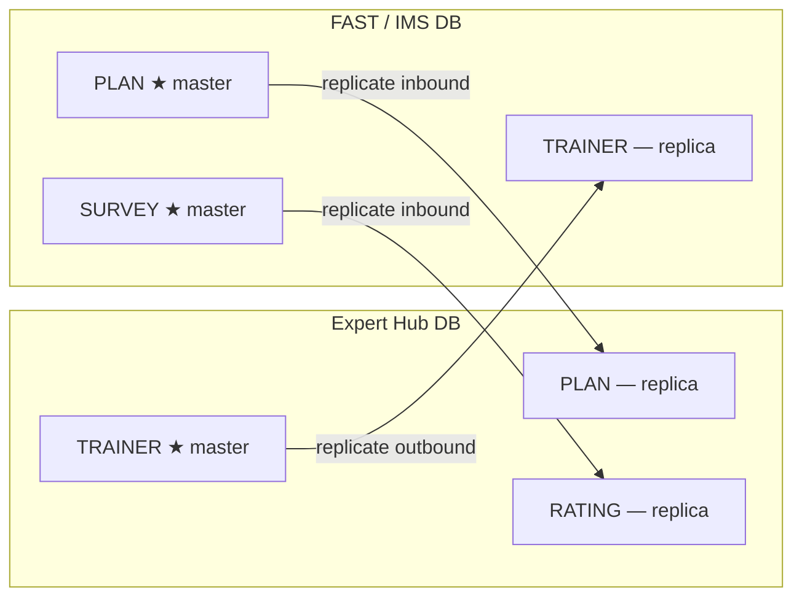
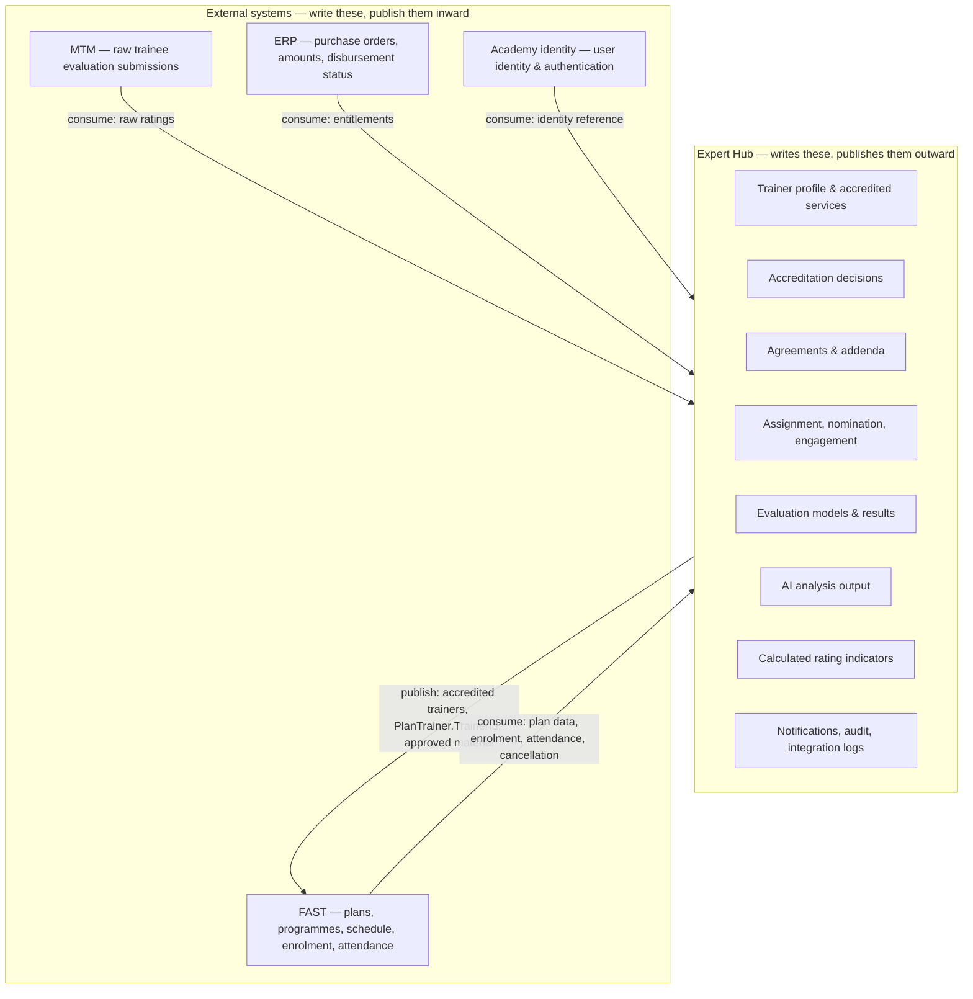
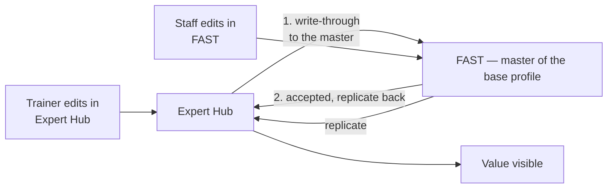

# 08 — Backend Architecture: the foundational proposal

**Status:** 🟢 Proposal for approval — first full pass, 2026-08-26.
**Pairs with:** [`10_DATABASE_DESIGN.md`](10_DATABASE_DESIGN.md) (the data half).
**Sources:** `BRD-TRN-001 v1.0` §8 (capabilities), §8.12 (integrations,
source-of-truth matrix, `BR-1201`→`BR-1206`), §9 (data model) · `02C`
(application/integration architecture) · `02D` (rating ownership) · the two
supplied FAST field files.

> **The proposal in one sentence.** Expert Hub is the **system of record for the
> Academy's *relationship* with independent experts** — accreditation,
> agreements, assignment, evaluation and AI analysis are its own — while the
> **trainer's base profile stays FAST's** (§1.2.1); the two exchange
> bidirectionally with **one master per layer**, and an edit made on the
> non-master side is **written through to the master** rather than kept locally
> (§1.2.2).

---

## 1. The one decision everything else follows from

### 1.1 «كتابة ثنائية» — settled: entity-level mastership

**Owner ruling, 2026-08-26:**

> «هو مش على حقل بس، نفس الكيانات تكون على الاثنين داتا بيس، وكل واحد يكتب — بس
> الحالة حقت المدرب مثلاً مصدرها الأساسي هو المنصة.»

So the model is **not** a field-by-field split. **The same entities exist in both
databases**, both systems write, and **each entity has one designated master**
whose version is authoritative.

That is a stronger and simpler arrangement than a field-level partition, and it
still satisfies `BR-1201` — *one source system per data element* — because the
source is declared **per entity** rather than per column. Nothing is invented at
conflict time: the master wins, always, and the rule is known in advance.



**What the replica side may and may not do:**

| | Allowed |
|---|---|
| ✅ | Read the replicated entity freely |
| ✅ | Hold **additional local fields it owns** — attributes the master has no concept of |
| ❌ | Write a field the master owns. **Such a write is silently lost at the next replication** |

> ⚠️ **The one thing to hold everyone to.** If FAST is ever built to edit a field
> on a platform-mastered entity, that edit disappears on the next sync — no
> error, no warning. This must be a documented contract with the FAST team, not
> an assumption. It is the single most likely way this design fails in practice.

### 1.1.1 The mastership register

Every shared entity, its master, and what the replica adds. This table is the
contract; `INTEGRATED_SYSTEM` / `DATA_ELEMENT` (CAP-12) hold it as data.

| Entity | Master | Replica | Replica's own fields |
|---|---|---|---|
| Trainer profile — **base** (identity, personal, job, education, certifications, experience, courses, areas, availability, bank) | **FAST** ★ | Expert Hub | — |
| Trainer profile — **accreditation layer** (accredited services, classification, file status, consent, calculated ratings, Academy record) | **Expert Hub** ★ | FAST | — |
| Agreement & addenda | **Expert Hub** ★ | — | not shared |
| Assignment, nomination, engagement | **Expert Hub** ★ | FAST (`PlanTrainer`) | — |
| Evaluation models & results (CAP-02) | **Expert Hub** ★ | — | not shared |
| AI analysis | **Expert Hub** ★ | — | never leaves |
| Roles & permissions | **Expert Hub** ★ | — | see §2.4 |
| Programme / Plan / ScheduleDay | **FAST** ★ | Expert Hub | — |
| Enrolment & attendance (`PlanTaker`) | **FAST** ★ | Expert Hub | — |
| Trainee evaluation (MTM survey) | **MTM, hosted in the IMS estate** ★ | Expert Hub | Calculated indicators (`02D`) |
| Entitlement / purchase order | **ERP** ★ | Expert Hub | `linkage_complete` (derived locally) |
| User identity | **Academy site** ★ | Expert Hub | Authorization — see §2.4 |

### 1.2 The partition, from §8.12.4



### 1.2.1 The trainer profile is split, not owned by one side

**Owner ruling, 2026-08-27:** *"training profile — it's owned by FAST, and it
will be also on Expert Hub, and the change will be dual."*

This **corrects `P-130`**, which read §8.12.4 as putting the whole trainer record
under Expert Hub. It does not, and the supplied schema is the proof: the trainer
profile already exists in the IMS estate — `dbo.AspNetUsers` (38 columns),
`profile.UserProfile` (60), plus education, certifications, experience, courses,
training areas, cooperation areas and availability. **Expert Hub is being built
beside a profile that is already there.**

§8.12.4's wording survives once read precisely. It assigns *«بيانات ملف المدرب
**المعروضة بـفاست**»* — **the trainer profile data that FAST displays** — to
Expert Hub. That is the narrower set: the things FAST has no concept of and
receives from us.

So the entity is **split by layer**, each layer with one master:

| Layer | Master | Contents |
|---|---|---|
| **Base profile** | **FAST** ★ | Identity, personal, contact, address, job, education, certifications, practical experience, training courses, training & cooperation areas, availability, bank data — everything the supplied files already model |
| **Accreditation layer** | **Expert Hub** ★ | Accredited services and their independent classification, file status, agreement linkage, visibility consent, calculated ratings, the Academy record |

The accreditation layer is exactly what §8.12.4 means by "displayed in FAST":
FAST shows a trainer as accredited for a service **because Expert Hub told it
so**, and FAST has no way to author that.

### 1.2.2 "Dual change" — how to have it without two masters

*"The change will be dual"* is a **user-facing** requirement: a trainer or a staff
member should be able to change the profile from **either** system. That is
achievable and reasonable.

What it must **not** become is two authoritative copies. Two masters on one field
with no arbiter is the one configuration this design cannot recover from — the
BRD gives no conflict rule (`BR-1201` exists precisely to prevent it), so the
answer would have to be invented, and the loser's edit disappears silently.

**Write-through gives the first without the second:**



- An edit made in Expert Hub to a **FAST-mastered** field is **forwarded to FAST
  and only shown as saved once FAST accepts it.** Expert Hub never holds an
  authoritative unsynced value, so the copies cannot diverge.
- An edit to an **Expert-Hub-mastered** field (accreditation, classification,
  consent) is written locally and replicated outward.
- If FAST is unreachable, the edit is **queued and shown as pending** — not
  applied locally and hoped for. `BR-1203` keeps the last known state; it does
  not license a second truth.

This is what makes «كل واحد يكتب» true in practice while keeping one master per
field — and it needs a **write API from FAST**, which is the practical
precondition. → `Q30`.

---

## 2. What the platform owns

Everything in BRD §9.3, grouped. The owner specifically called out evaluation and
AI; both are here, and both have architectural consequences.

### 2.1 Evaluation — three distinct things, often confused

| | What | Owner | Note |
|---|---|---|---|
| **Screening evaluation** | Model + weights per service, and the resulting score | **Platform** | Config-as-data (`BR-0203`): the System Administrator edits it **without a deployment** |
| **Interview evaluation** | Axes, scores, final-result formula | **Platform** | Same — a separate, independently editable model |
| **Trainee rating** | The raw submission | **MTM** (INT-02) | Immutable original (`02D`) |
| **Trainee rating** | Every calculated indicator built from it | **Platform** | `02D` §1 — programme rating, overall rating, trends, weighted results |

`BR-0203` is an architecture requirement, not a preference: the evaluation models
are **data rows, never code**. A weight change must not require a release.

### 2.2 AI — advisory, isolated, and structurally unable to leak

`BR-0201` and `BR-0202` are unusually strict, and they are an **architectural
boundary**, not a UI rule:

> `BR-0201` — each service's score is computed by a **fixed weighted formula**
> from its own evaluation model, **with no AI input into the official score**.
>
> `BR-0202` — AI analyses **qualitative questions only**, produces a **separate**
> score/summary shown to the screening manager as **advisory information**, and
> **is never merged into the official score, under any circumstance**.

How that is enforced rather than trusted:

- **AI output is its own entity**, `AI_ANALYSIS`, linked to the application —
  never a column on `SCREENING_RESULT`.
- **The official score function takes the evaluation model and the answers.** It
  does not take `AI_ANALYSIS` as a parameter, so no code path can feed it in —
  the same technique the frontend uses throughout (P-79, P-96, P-126).
- **The AI service is an outbound-only consumer**: it reads answers, writes
  analysis. It has no write access to any scoring entity.
- The AI provider is an **integration**, not a library call: it belongs in the
  registry (CAP-12), is logged like every other crossing (`BR-1204`), and must
  degrade to *unavailable* without blocking a screening decision.

#### The provider — decided, with one thing still to settle

**Owner ruling, 2026-08-26:** «مزود الذكاء الاصطناعي سيكون باستخدام API خاص، إما
OpenAI أو Claude.»

So the analysis runs on an **external LLM API**. Three consequences for the
design:

1. **Provider-agnostic port.** OpenAI and Claude are both named, so neither is
   assumed: the capability depends on an `IAiAnalysisProvider` interface, and the
   choice — including a future on-premise model — is configuration, not a
   rewrite. Prompt and model version are stored with each result, so an analysis
   can always be explained after the fact.
2. **It becomes `INT-06`.** §8.12.3 lists INT-01…INT-05 and the AI provider is
   not among them, so the registry, the data-element rows and the integration log
   need an entry like every other crossing (`BR-1204`).
3. **Data minimisation is a design requirement, not a nicety.** Only the
   qualitative answer text is sent. **No name, no national ID, no contact
   detail, no application reference** — the provider receives text to analyse and
   nothing that identifies whose text it is.

> ⚠️ **One question that is not technical.** This sends **applicant free-text
> outside the Academy's boundary** to a third-party API. For a DGA-registered
> government platform holding personal data, whether that is permitted — and
> under what terms (data residency, retention at the provider, no-training
> guarantees, PDPL and SDAIA obligations) — is a **data-protection and
> procurement ruling**, not an engineering one.
>
> The architecture is built so the answer can be either: the port makes an
> on-premise or in-Kingdom model a configuration change, and `BR-0202` already
> makes the whole feature advisory, so **screening works unchanged if AI is
> switched off entirely**. But the ruling is needed before INT-06 goes live.
> → `Q28`.

### 2.3 Roles & permissions — authentication is external, authorization is ours

**Owner ruling, 2026-08-26:** «الأدوار والصلاحيات تكون من قِبل مدير النظام،
وتكون مملوكة للمنصة، والتحكم بها في المنصة.»

This confirms the split that `BR-1205` implies and CAP-08 describes:

| | Where it lives |
|---|---|
| **Authentication** — who you are | **Academy identity, INT-01.** No credential is ever stored here |
| **Authorization** — what you may do | **Expert Hub, entirely.** Roles, permissions, role×permission matrix and assignment are platform entities, managed by مشرف النظام |

Two design consequences:

- **The matrix is data, not code** (`BR-0807`). The System Administrator edits
  role×permission from a screen; a permission change never requires a release.
- **One permission per capability feature** (§8.8.4), so the matrix stays
  mechanical: each of the twelve capabilities enumerates its features, and each
  feature is one togglable unit.

`DM-GAP-07` supplies the approved matrix contents. The *structure* above does not
depend on it.

### 2.4 Everything else the platform owns

Join applications · screening results · interview results · accreditation
decisions · trainer profiles and accredited services · candidate pools and
nominations · engagements · the trainer's Academy record · public profiles and
visibility consent · notification matrix, templates and log · SLA matrix · roles,
permissions and audit · the integration registry and its logs.

---

## 3. Service boundaries

One bounded context per capability. Build order is dependency-driven, from
`01_PRODUCT_DISCOVERY` §8:

```
CAP-08 Identity & Access  ─┐
CAP-12 Integration Hub    ─┼─ foundational; everything depends on them
CAP-07 Communication      ─┘

CAP-01 Application → CAP-02 Screening → CAP-03 Agreement → CAP-04 Profile
                                                         → CAP-05 Assignment
                                                         → CAP-06 Entitlement
CAP-09 Analytics    — read-only projections, no storage of its own
CAP-10 Public       — read-only projection of CAP-04 behind consent
CAP-11 Community    — deferred, no approved entities
```

**Analytics owns no source data** (§8.9.1) — it reads from the other eleven and
stores only metric *definitions*. Public Presence likewise projects; it never
authors.

---

## 4. The integration layer

### 4.1 The five crossings, plus one to register

| | System | Direction | Pattern | Trigger | Failure behaviour |
|---|---|---|---|---|---|
| **INT-01** | Academy identity | ⇄ | Sync, request-time | Login, entry links | Deny access; never a local credential fallback (`BR-1205`) |
| **INT-02** | MTM survey data — **hosted in the IMS estate alongside FAST** (see §4.4) | ← in | Async, push or scheduled pull | Evaluation submitted | Retry; last-known-state; original never overwritten |
| **INT-03** | ERP | ← in | Async, scheduled | Disbursement processed | Retry; keep last state; `linkage_complete` recomputed |
| **INT-04** | Email gateway | → out | Async, queued | Any notification-matrix event | Retry with backoff; every attempt in `NOTIFICATION_LOG` |
| **INT-05a** | FAST | ← in | Async + on-demand read | Plan read, execution updates | Cached last-known-state; stale marker on read |
| **INT-05b** | FAST | → out | Async, event-driven | Accreditation; engagement confirmed | **Idempotent retry** — see §4.2 |
| **INT-06** | AI provider — **external LLM API (OpenAI or Claude)** | ⇄ | Async, request/response | Application submitted | **Degrade to unavailable**; never block a screening decision. Needs a data-protection ruling before go-live — `Q28` |

### 4.2 The outbound half — how writing into FAST stays safe

This is the part a bidirectional design gets wrong, so it is specified rather
than assumed:

1. **Ownership check first.** An outbound write is only ever to a field the
   source-of-truth matrix assigns to Expert Hub. The set is small and explicit:
   accredited trainer records, `PlanTrainer.TrainerId`, approved training
   material. Anything else is a bug, not a feature.
2. **Idempotency key on every write.** `(entity, entity_id, version)`. A retry
   after an ambiguous timeout must not create a second `PlanTrainer` row.
3. **Outbox, not inline.** The write is committed to a local outbox in the same
   transaction as the business change, then published. A confirmed engagement
   must never be lost because FAST was briefly unreachable — and FAST must never
   be told about an engagement the platform failed to commit.
4. **Per-slot, not per-request.** J-18/F4/AC-1 requires the sync to happen for a
   confirmed slot "with no waiting for the remaining slots", so the outbox entry
   is per engagement.
5. **Every attempt is logged** (`BR-1204`) with outcome, and reconciliation
   compares the two sides periodically. **Bidirectional integration drifts;** a
   design without drift detection is a design that discovers the drift from a
   user.

### 4.3 The inbound half

- **Consumed data is written by exactly one importer per system**, into entities
  no user-facing write path can touch (`BR-1202`, `BR-0601`, `BR-1206`).
- **Last known state survives** (`BR-1203`): `last_synced_at` + `sync_status` on
  every mirrored entity, and the UI says when a value is stale rather than
  pretending it is current.
- **Three storage strategies**, per `10_DATABASE_DESIGN.md` §1.2 — referenced
  (FAST plans), permanent integrated record (MTM ratings), mirrored for tracking
  (ERP entitlements). They are not interchangeable.

### 4.4 MTM lives in the same estate as FAST — and a journey says otherwise

> **Followed through, 2026-09-02 (`P-200`).** «MTM the data is on FAST already so
> we don't need it» — INT-02 is **not a separate connection**. Its data elements
> ride the INT-05 link; MTM stays the master, so `BR-1201` is untouched, but
> there is no second endpoint to contract, authenticate or schedule.
> `G41`–`G44`, `G28`, `G57`/`G58` and `Q29` are cancelled with it. See also
> `P-201`: identity verification is **Yaqeen**, also through FAST.

**Owner ruling, 2026-08-26:** «سجلات MTM موجودة على فاست، ونسوي معها نفس الفكرة.»

The supplied schema agrees: `ImsCommon.Survey.Instructor` and
`ImsCommon.Survey.SurveyResponse` arrived in the **FAST history file**. MTM's
records sit in the IMS database estate — `ImsCommon.*` beside FAST's
`ImsTraining.*` — so they replicate on exactly the same mechanism, with MTM as
master and Expert Hub holding the replica plus its own calculated indicators
(`02D`).

> ⚠️ **This contradicts J-21/F6/AC-2**, which says trainee evaluations reach the
> platform *«عبر تكامل مباشر بين المنصة وMTM — دون فاست كوسيط»* — directly from
> MTM, **without FAST as an intermediary**.
>
> The two are reconcilable, and the distinction matters: the records are
> **stored** in the shared IMS estate, but Expert Hub reads them from the
> `ImsCommon.Survey` schema **directly**, not by asking FAST's training module
> for them. FAST is not an intermediary; it is a neighbour in the same database.
>
> **Confirm that reading.** If instead the intent is that FAST's application
> layer serves the ratings onward, J-21/F6/AC-2 is contradicted outright and the
> journey needs amending rather than reinterpreting. → `Q29`.

---

## 5. Cross-cutting guarantees

| Concern | Requirement | Rule |
|---|---|---|
| **Config-as-data** | Evaluation models, matching weights, role×permission matrix, notification matrix, SLA matrix — all editable without a deployment | `BR-0103`, `BR-0203`, `BR-0807`, `BR-0705` |
| **Audit immutability** | Append-only; no update or delete path exists | `NFR-07`, §8.8.2 |
| **Eventing** | Every capability emits lifecycle events; CAP-07 alone resolves recipient, template and channel | `BR-0703` |
| **Source-of-truth enforcement** | No in-platform edit of consumed data — enforced by the absence of a write path, not by a guard | `BR-1201`, `BR-1202`, `BR-1206` |
| **Traceability** | Every crossing writes `INTEGRATION_LOG` | `BR-1204` |
| **Degradation** | Last known state + log + notify | `BR-1203` |
| **Identity** | No authentication data stored locally | `BR-1205` |
| **Bilingual** | Every user-facing string is an AR/EN pair; AR authoritative | Localization requirements §10.4 |

---

## 6. Settled, and still open

### Settled by owner ruling, 2026-08-26

| | Ruling |
|---|---|
| **Write model** | **Entity-level mastership.** The same entities exist in both databases, both write, and each entity has one master whose version is authoritative (§1.1) |
| **Trainer profile** | **Split by layer** (§1.2.1): FAST masters the base profile, Expert Hub masters the accreditation layer. Changes are **dual via write-through**, not dual-master (§1.2.2). Corrects `P-130` |
| **MTM records** | Hosted in the IMS estate beside FAST; replicated on the same mechanism, MTM as master (§4.4) |
| **AI provider** | External LLM API — OpenAI or Claude — behind a provider-agnostic port (§2.2) |
| **Roles & permissions** | Platform-owned and platform-managed, by مشرف النظام. Authentication external, authorization internal (§2.3) |

### Still open

1. **`Q28` — the data-protection ruling on INT-06.** Applicant free-text leaving
   the Academy's boundary to a third-party API. The design degrades safely
   without AI, so this blocks *go-live of the feature*, not the build.
2. **`Q29` — the MTM/FAST reading** (§4.4). Does "directly, without FAST as an
   intermediary" mean *reading the shared `ImsCommon.Survey` schema directly*? If
   not, J-21/F6/AC-2 needs amending.
3. **`Q30` — does FAST expose a write API?** Write-through (§1.2.2) is what makes
   "dual change" safe, and it needs FAST to accept writes from Expert Hub. If it
   cannot, dual change on FAST-mastered fields is not deliverable and those
   fields become read-only in Expert Hub — a product decision, not a technical
   workaround.
4. **The replication contract with the FAST team** — specifically that a write to
   a field the other side masters is silently lost unless it goes through
   write-through (§1.1). This has to be agreed with them, not assumed.
4. **`DM-GAP-07`** — the approved role×permission contents. Structure is settled;
   contents are not.
5. **`Q20`** — `plan.PlanTaker`, still the only entity in the model with no
   definition at all.
6. **Replication mechanics** — CDC, message queue, scheduled diff or direct DB
   link. Depends on what the IMS estate can offer; see §7.

---

## 7. Still open

Runtime and framework are undecided.

So is **how replication physically happens**. Entity-level mastership is the
*contract*; the mechanism could be change-data-capture, a message queue, a
scheduled diff, or — since MTM and FAST share the IMS estate — a direct database
link. Each has very different failure and latency behaviour, and the choice
depends on **what the IMS/FAST, MTM and ERP teams can actually offer**, which no
document here states.

That is a conversation with those teams before it is a line in a design.
