# 10 — Database Design & ERD

**Status:** 🟢 Live — first full pass, 2026-08-26.
**Sources of truth, in order:** `BRD-TRN-001 v1.0` §8 (capabilities + owned
entities), §8.12 (integrations + source-of-truth matrix), §9 (preliminary data
model) · the two supplied FAST field files · `02D` (rating ownership, which
corrects `02C`) · the 24 journey documents for operational detail.

> **What this is.** The entities the Expert Hub database owns, their
> relationships, and — the part that decides the architecture — **which data it
> owns versus which it merely holds a copy of, and where every integration
> crosses.**
>
> **Scope.** **Every entity the platform needs, across all twelve capabilities**
> — 90 owned entities plus 7 replicas of externally-mastered ones, 644
> attributes in all. Not physical DDL: types are indicative, and attributes marked
> `⟨gap⟩` are shaped but await the input named in §7. The *entities and
> relationships* do not depend on those inputs.

---

## 1. The four principles

### 1.1 Two zones, from BRD §9.1

§9 splits every entity in the product into exactly two kinds, and the split is
the backbone of this design:

- **§9.3 — operational entities the platform produces.** Expert Hub is the source
  of truth. Twelve are named: join application · initial screening result ·
  interview evaluation result · accreditation decision · trainer profile ·
  candidate list · trainer↔programme engagement · trainer record · public profile
  · notification log · audit log · integration log.
- **§9.2 — reference entities received from existing sources.** Another system is
  authoritative. Eight are named, including identity, the agreement document,
  FAST programme data, ERP disbursement data and trainee evaluations.

`BR-1201` makes the split binding: *each integration relies on **one** source
system, and no alternative source for the same data may be created inside the
platform.* `BR-1202` adds that received data may not be modified except through
its source system.

### 1.2 "Consumed" is three different things

This is the refinement §9.2 does not make and the design needs. All three are
*consumed*, and they behave completely differently:

| Kind | Example | What the database holds | Why |
|---|---|---|---|
| **Referenced** | FAST plan & programme | Foreign id + a display cache, refreshed on read | FAST owns programme execution data (§8.12.4). We show it; we never reason from a stale copy |
| **Integrated business record** | MTM rating submissions | A **permanent** row, original value immutable | `02D` §1: once received it becomes part of Expert Hub's own operational history — queried, referenced by calculation runs, audited, **even if MTM's copy later changes**. Not a disposable cache |
| **Mirrored for tracking** | ERP entitlements | A row per purchase order, never editable | `BR-0601`/`BR-1206` — consumed whole; the platform displays and tracks, calculates nothing |

`BR-1203` then requires all three to survive an outage: *the platform keeps the
**last known state**, logs the error, and notifies.* So every mirrored entity
carries `last_synced_at` and `sync_status` — a copy with standing, not a cache
that may vanish.

### 1.3 Person → services → one agreement

BRD §6.1 fixes the grain of the whole model:

- one person may hold **several services at once**, and **each has its own
  evaluation and accreditation**
- **one unified agreement** covers all of a person's accredited services
- adding a service to an accredited person **does not create a new agreement** —
  it becomes an **addendum** on the existing one
- **Speaker is outside all of it**: internal registration only, no contractual or
  financial obligation, never part of any agreement

So `APPLICATION_SERVICE`, `TRAINER_SERVICE` and `AGREEMENT_SERVICE` all exist as
join entities. Decisions that are "per application" in conversation are almost
always **per application-service** in the schema.

### 1.4 What the platform never stores

- **Authentication data.** `BR-1205` — identity is the Academy site's (INT-01);
  the platform stores a reference, never a credential.
- **Agreement document content.** §9.2 — the document is *prepared outside the
  platform*; Expert Hub uploads, links and tracks status "دون تحرير محتواها داخل
  المنصة".
- **Any calculated entitlement amount.** §8.6.1 — the capability calculates no
  amount and creates no disbursement order.
- **A second source for anything already owned elsewhere** (`BR-1201`).

---

## 2. The integration boundary

Five integrations, from BRD §8.12.3. **Two are bidirectional, and both directions
matter to the schema.**

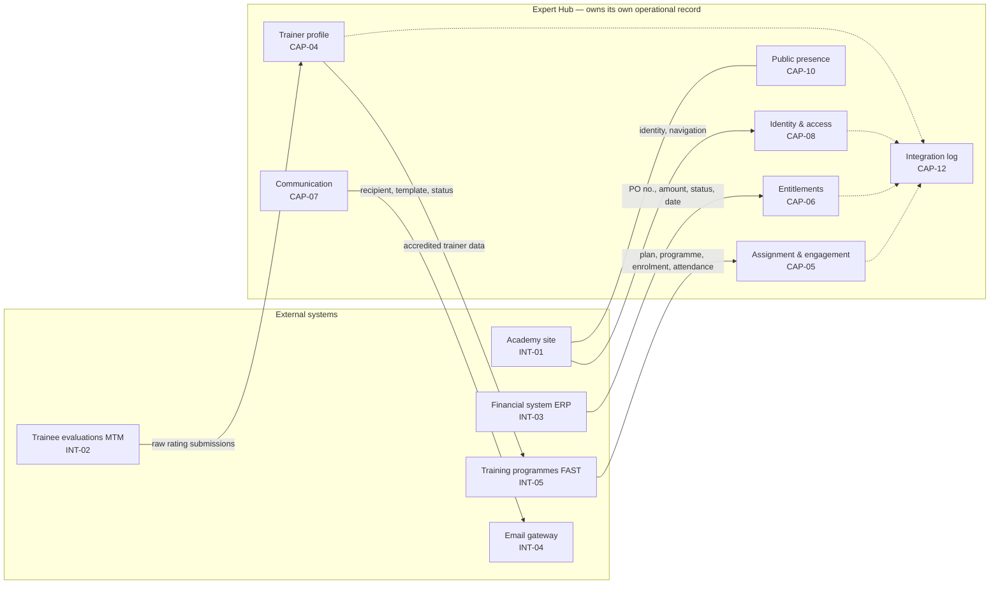

### The direction that is easy to miss

§8.12.4's source-of-truth matrix says:

> **بيانات ملف المدرب المعروضة بـFAST → منصة إدارة الخبراء**

**Expert Hub owns the trainer data FAST displays.** INT-05 is bidirectional
because Expert Hub *publishes* accredited trainers into FAST so they can be
scheduled, and *receives* programme execution data back. J-18/F4's write of
`PlanTrainer.TrainerId` is one instance of the outbound half.

Everything else FAST holds — plans, programmes, enrolment, scheduling — is
**FAST's** (§8.12.4, last row). Expert Hub references it.

---

## 3. The complete entity model

**90 owned entities across the twelve capabilities**, plus **7 replicas** of
externally-mastered ones — **97 in total, 644 attributes**. Every entity
the platform needs is here. Entities prefixed `EXT_` are replicas Expert Hub holds
but does not master (§1.1.1).

Attributes marked `⟨gap⟩` in a comment are shaped but not final — the input that
fixes them is named in §7.

### 3.0 Entity index

| Capability | Entities |
|---|---|
| **Shared** | `ATTACHMENT` · `REFERENCE_LIST` · `REFERENCE_VALUE` |
| **CAP-08** Identity & access | `APP_USER` · `ROLE` · `PERMISSION` · `ROLE_PERMISSION` · `USER_ROLE` · `AUDIT_LOG` |
| **CAP-01** Application | `APPLICATION` · `APPLICATION_SERVICE` · `FORM_SCHEMA` · `FORM_SECTION` · `FORM_FIELD` · `ATTACHMENT_RULE` · `APPLICATION_FIELD_VALUE` · `APPLICATION_ATTACHMENT` · `SERVICE_REQUEST` · `SPEAKER_RECORD` |
| **CAP-02** Screening & evaluation | `EVALUATION_MODEL` · `EVALUATION_CRITERION` · `SCREENING_RESULT` · `SCREENING_CRITERION_SCORE` · `AI_ANALYSIS` · `INTERVIEW` · `INTERVIEW_SLOT` · `INTERVIEW_MODEL` · `INTERVIEW_AXIS` · `INTERVIEW_EVALUATION` · `INTERVIEW_AXIS_SCORE` · `COMMITTEE_TEMPLATE` · `COMMITTEE_SEQUENCE` · `COMMITTEE_STEP` · `ACCREDITATION_DECISION` |
| **CAP-03** Agreement | `AGREEMENT` · `AGREEMENT_SERVICE` · `ADDENDUM` · `AGREEMENT_TEMPLATE` · `AGREEMENT_DOCUMENT` · `SIGNING_SEQUENCE` · `SIGNATORY` · `E_SIGNATURE` · `AGREEMENT_EVENT` |
| **CAP-04** Trainer profile | `TRAINER_PROFILE` · `TRAINER_SERVICE` · `EDUCATION` · `PROFESSIONAL_CERTIFICATION` · `PRACTICAL_EXPERIENCE` · `TRAINING_COURSE` · `AREA_OF_TRAINING` · `AREA_OF_COOPERATION` · `AVAILABILITY` · `BANK_DATA` · `PROFILE_CHANGE_REQUEST` · `TRAINER_RECORD` · `RATING_SOURCE_RECORD` · `TRAINER_RATING` |
| **CAP-05** Assignment | `ASSIGNMENT_REQUEST` · `ASSIGNMENT_SLOT` · `MATCHING_MODEL` · `MATCHING_RUN` · `MATCH_CANDIDATE` · `MATCH_EXCLUSION` · `CANDIDATE_POOL` · `POOL_MEMBER` · `SLOT_CYCLE` · `ASSIGNMENT_OFFER` · `ENGAGEMENT` · `ENGAGEMENT_TERMINATION` · `MATERIAL_SUBMISSION` · `SUBMISSION_ROUND` |
| **CAP-06** Entitlement | `ENTITLEMENT` |
| **CAP-07** Communication | `NOTIFICATION_EVENT` · `NOTIFICATION_TEMPLATE` · `NOTIFICATION_MATRIX_ROW` · `NOTIFICATION_LOG` · `SLA_MATRIX_ROW` · `SLA_INSTANCE` |
| **CAP-09** Analytics | `METRIC_DEFINITION` · `DASHBOARD` · `DASHBOARD_METRIC` · `REPORT_DEFINITION` · `REPORT_RUN` |
| **CAP-10** Public presence | `VISIBILITY_CONSENT` · `PUBLIC_PROFILE` · `LANDING_CONTENT` |
| **CAP-12** Integration | `INTEGRATED_SYSTEM` · `DATA_ELEMENT` · `INTEGRATION_LOG` · `REPLICATION_STATE` |
| **Replicas** | `EXT_ACADEMY_IDENTITY` · `EXT_FAST_PROGRAM` · `EXT_FAST_PLAN` · `EXT_FAST_SCHEDULE_DAY` · `EXT_FAST_PLAN_TRAINER` · `EXT_FAST_PLAN_TAKER` · `EXT_ERP_PURCHASE_ORDER` — MTM's records take local form as `RATING_SOURCE_RECORD` (§3.6) |

---

### 3.1 Shared — attachments and reference lists

Every document in the product is one `ATTACHMENT`. Every platform-owned
enumeration is a `REFERENCE_VALUE`, so a System Administrator can add a value
without a release (`BR-0103`).

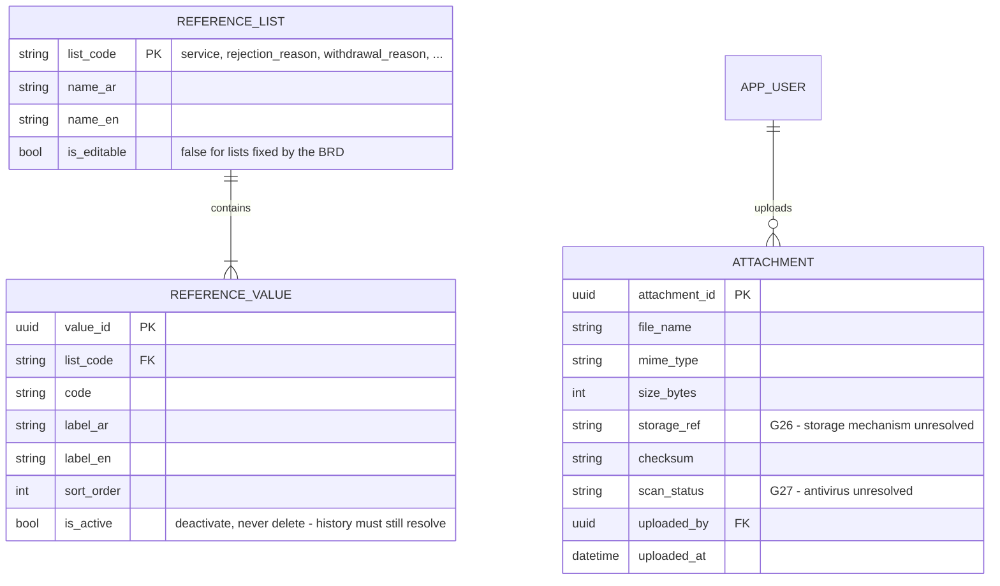

---

### 3.2 CAP-08 — identity, roles, permissions, audit

Authentication is INT-01's; **authorization is entirely the platform's**
(`P-133`). Six fixed roles (§8.8.5).

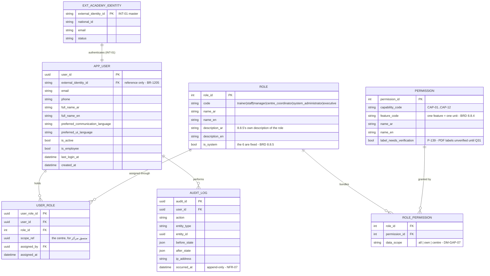

---

### 3.3 CAP-01 — application, the form schema, and service requests

The form is **schema-driven and versioned** (`BR-0103`): sections, fields and
attachment rules are rows, so the approved `DM-GAP-01` map replaces data rather
than code. A submitted application keeps the `schema_version` it was answered
against, so an old application still renders correctly years later.

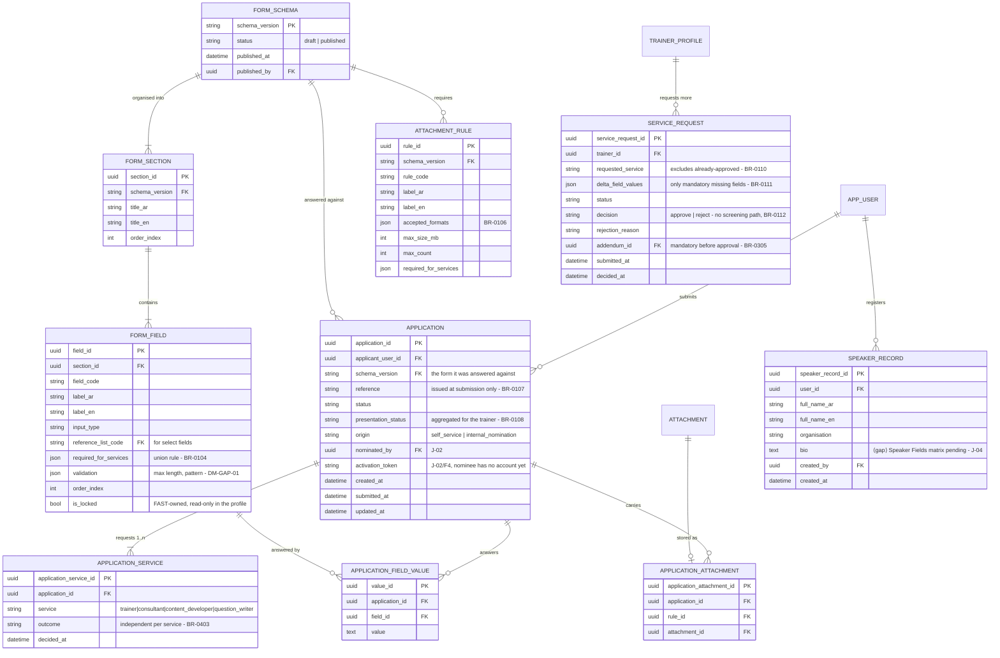

---

### 3.4 CAP-02 — screening, AI, interview, committee, decision

Everything hangs off `APPLICATION_SERVICE`, never `APPLICATION` — each service is
evaluated and accredited independently (§6.1, `BR-0403`).

> **Implementation notes (2026-08-31, `P-187`):** migration 06 deviates from
> this ERD in three recorded places, each forced by the built wire contracts:
> `INTERVIEW` references `APPLICATION` (one ticket, one slot set, one
> committee — J-06/J-07's shape; the per-service independence lives in
> `INTERVIEW_AXIS_SCORE.service`); `EVALUATION_CRITERION.source_field_id` is
> `source_section_code` (the J-05 matrix scores the form's sections 2–6, not
> single fields); and the J-07/F3 post-interview decision columns live on
> `INTERVIEW`. The member assignment is an `INTERVIEW_EVALUATION` row with
> `submitted_at IS NULL`, which makes `BR-0220` a query rather than a flag.

**`AI_ANALYSIS` is a sibling of `SCREENING_RESULT`, never a column on it**
(`BR-0201`/`BR-0202`, §2.2).

```mermaid
erDiagram
  EVALUATION_MODEL ||--|{ EVALUATION_CRITERION : "weighted by"
  APPLICATION_SERVICE ||--o| SCREENING_RESULT : screened
  EVALUATION_MODEL ||--o{ SCREENING_RESULT : "scored with"
  SCREENING_RESULT ||--|{ SCREENING_CRITERION_SCORE : "broken down into"
  APPLICATION ||--o| AI_ANALYSIS : "advisory only - BR-0202"
  APPLICATION_SERVICE ||--o| INTERVIEW : "may require"
  INTERVIEW ||--|{ INTERVIEW_SLOT : proposes
  INTERVIEW_MODEL ||--|{ INTERVIEW_AXIS : "measured on"
  INTERVIEW ||--o{ INTERVIEW_EVALUATION : "evaluated by"
  INTERVIEW_EVALUATION ||--|{ INTERVIEW_AXIS_SCORE : scores
  APP_USER ||--o{ INTERVIEW_EVALUATION : conducts
  COMMITTEE_TEMPLATE ||--o{ COMMITTEE_SEQUENCE : "copied into"
  APPLICATION ||--o| COMMITTEE_SEQUENCE : "reviewed by"
  COMMITTEE_SEQUENCE ||--|{ COMMITTEE_STEP : "ordered 1..n"
  APP_USER ||--o{ COMMITTEE_STEP : "acts in"
  APPLICATION_SERVICE ||--o| ACCREDITATION_DECISION : concludes

  EVALUATION_MODEL {
    uuid model_id PK
    string service
    string version
    decimal pass_threshold "⟨gap⟩ DM-GAP-02"
    bool is_active "editable by sysadmin, no deploy - BR-0203"
    datetime effective_from
  }
  EVALUATION_CRITERION {
    uuid criterion_id PK
    uuid model_id FK
    string label_ar
    string label_en
    uuid source_field_id FK "tied to a form field - DM-GAP-02"
    decimal weight
    int order_index
  }
  SCREENING_RESULT {
    uuid screening_result_id PK
    uuid application_service_id FK
    uuid model_id FK
    decimal objective_score "fixed formula, NO AI input - BR-0201"
    string decision "accept | reject | exempt_interview"
    string rejection_reason FK
    string exemption_reason "3 approved reasons + other - J-08"
    uuid decided_by FK
    datetime decided_at
    datetime sla_due_at
  }
  SCREENING_CRITERION_SCORE {
    uuid score_id PK
    uuid screening_result_id FK
    uuid criterion_id FK
    decimal raw_score
    decimal weighted_score
  }
  AI_ANALYSIS {
    uuid analysis_id PK
    uuid application_id FK
    text summary_ar "qualitative questions ONLY - BR-0202"
    decimal advisory_score "SEPARATE - never merged into the official score"
    string provider "INT-06, provider-agnostic port - P-132"
    string model_version "stored so the analysis stays explainable"
    string prompt_version
    string status "produced | unavailable - degrades without blocking"
    datetime produced_at
  }
  INTERVIEW {
    uuid interview_id PK
    uuid application_service_id FK
    string ticket_number "survives reschedules - J-06/F4/AC-6"
    string status
    uuid confirmed_slot_id FK
    bool can_request_reschedule "server-decided"
    text reschedule_note
    string meeting_url "Teams - integration not in CAP-12"
    datetime sla_due_at "3 business days - J-06/F1/AC-4"
  }
  INTERVIEW_SLOT {
    uuid slot_id PK
    uuid interview_id FK
    datetime starts_at
    datetime ends_at
    bool is_superseded "kept, so a reschedule history exists"
  }
  INTERVIEW_MODEL {
    uuid interview_model_id PK
    string service
    string version
    string aggregation_rule "⟨gap⟩ DM-GAP-03"
    bool is_active
  }
  INTERVIEW_AXIS {
    uuid axis_id PK
    uuid interview_model_id FK
    string label_ar
    string label_en
    decimal weight
    decimal max_score
  }
  INTERVIEW_EVALUATION {
    uuid interview_evaluation_id PK
    uuid interview_id FK
    uuid evaluator_user_id FK
    uuid interview_model_id FK
    bool did_not_attend
    decimal total_score
    text note
    datetime submitted_at "result withheld until all respond - BR-0220"
  }
  INTERVIEW_AXIS_SCORE {
    uuid axis_score_id PK
    uuid interview_evaluation_id FK
    uuid axis_id FK
    decimal score
  }
  COMMITTEE_TEMPLATE {
    uuid template_id PK
    string name
    json members "COPIED on reuse, never referenced - J-09"
    uuid created_by FK
  }
  COMMITTEE_SEQUENCE {
    uuid sequence_id PK
    uuid application_id FK
    uuid created_from_template_id FK
    string status
    int current_step_index "sequential, auto-advance - J-09"
  }
  COMMITTEE_STEP {
    uuid step_id PK
    uuid sequence_id FK
    uuid member_user_id FK
    int order_index
    bool is_mandatory "mandatory rejection halts; optional logs a note"
    string decision "approve | reject | request_modification"
    text note
    datetime acted_at
  }
  ACCREDITATION_DECISION {
    uuid decision_id PK
    uuid application_service_id FK
    string outcome "accredited | rejected"
    string classification "⟨gap⟩ per service - BR-0403"
    uuid decided_by FK
    datetime decided_at
  }
```

---

### 3.5 CAP-03 — agreement, addenda, signing, lifecycle

One unified agreement per person covering every accredited service; an added
service becomes an **addendum**, never a second agreement (§6.1). The document is
authored **outside** the platform (§9.2) — uploaded, linked, tracked, never
edited here.

> **Implementation notes (2026-08-31, `P-188`):** migration 07 deviates in four
> recorded places. The party is `APP_USER` (`TRAINER_PROFILE` arrives with
> BE-09). **`AGREEMENT_DOCUMENT` is not built** — `G26` means nothing can store
> a file, so `ADDENDUM.document_file_name` stands in and every `documentUrl`
> serves null rather than a dead link. The applicant's J-11 decision lives on
> `AGREEMENT` (they are not an internal `SIGNATORY`). And **`expired` is
> derived** from `ends_at` on read, never stored: a lapse is a fact about the
> calendar, not an act someone performed. `BANK_DATA` (J-09/F6) is added here
> too — one row per user, requested by the committee's final approval.

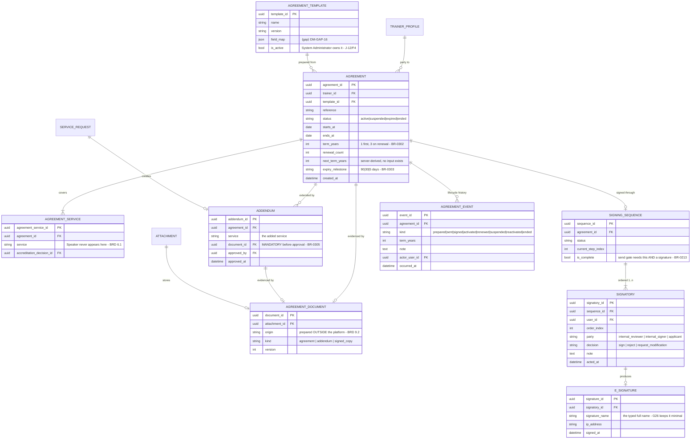

---

### 3.6 CAP-04 — the trainer profile and everything under it

⚠️ **Split mastership** (`P-134`, corrects `P-130`). The **base profile is
FAST's** — it already exists there as `dbo.AspNetUsers` + `profile.*`, which is
what the supplied files describe. Expert Hub masters only the **accreditation
layer**: `TRAINER_SERVICE`, `file_status`, `VISIBILITY_CONSENT`, `TRAINER_RATING`
and `TRAINER_RECORD`.

> **Implementation note (2026-08-31, `P-192`):** migration 09 builds
> `TRAINER_PROFILE`, `TRAINER_SERVICE`, `TRAINER_FIELD_VALUE`,
> `PROFILE_CHANGE_REQUEST`, `TRAINER_RECORD`, `RATING_SOURCE_RECORD` and
> `TRAINER_RATING`. The **FAST-mastered sub-entities below — `EDUCATION`,
> `PROFESSIONAL_CERTIFICATION`, `PRACTICAL_EXPERIENCE`, `TRAINING_COURSE`,
> `AREA_OF_*`, `AVAILABILITY` — are deliberately NOT built.** They are FAST's
> own tables, and what the built contract renders is a flat `fieldValues` map
> over the shared application schema (`BR-0404`: the same fields, no separate
> update form) — so `TRAINER_FIELD_VALUE` holds it, and the replicas arrive
> with the INT-05a inbound feed that would populate them (no agreed
> contract; `G41`–`G44` are MTM's, not INT-05a's — corrected 2026-09-02).
> `BANK_DATA` shipped with BE-08 keyed by **user**, not trainer: J-09/F6
> collects it before the trainer record exists.

Changes are **dual via write-through**: an edit to a FAST-mastered field made in
Expert Hub is forwarded to FAST and shown as saved only once FAST accepts it, so
the two copies cannot diverge. See
[`08_BACKEND_ARCHITECTURE.md`](08_BACKEND_ARCHITECTURE.md) §1.2.2.

```mermaid
erDiagram
  APP_USER ||--|| TRAINER_PROFILE : becomes
  TRAINER_PROFILE ||--|{ TRAINER_SERVICE : "accredited for"
  TRAINER_PROFILE ||--o{ EDUCATION : holds
  TRAINER_PROFILE ||--o{ PROFESSIONAL_CERTIFICATION : holds
  TRAINER_PROFILE ||--o{ PRACTICAL_EXPERIENCE : holds
  TRAINER_PROFILE ||--o{ TRAINING_COURSE : attended
  TRAINER_PROFILE ||--o{ AREA_OF_TRAINING : declares
  TRAINER_PROFILE ||--o{ AREA_OF_COOPERATION : declares
  TRAINER_PROFILE ||--o{ AVAILABILITY : declares
  TRAINER_PROFILE ||--o| BANK_DATA : holds
  TRAINER_PROFILE ||--o{ PROFILE_CHANGE_REQUEST : requests
  TRAINER_PROFILE ||--o{ TRAINER_RECORD : accumulates
  TRAINER_PROFILE ||--o{ RATING_SOURCE_RECORD : receives
  TRAINER_PROFILE ||--o{ TRAINER_RATING : "calculated into"

  TRAINER_PROFILE {
    uuid trainer_id PK
    uuid user_id FK
    string fast_user_profile_id FK "FAST masters the base profile - P-134"
    string file_status "EXPERT HUB masters this - INTERNAL ONLY, BR-0408"
    date date_of_birth
    string gender
    string nationality
    string id_type "national|iqama|gcc|passport"
    string id_number
    string address_ar
    string address_en
    string city
    string country
    string job_title_ar
    string job_title_en
    string organisation
    string social_media_url "one URL - Q19 says the card wants several"
    uuid photo_attachment_id FK
    uuid cv_attachment_id FK
    datetime created_at "after signature - J-13"
  }
  TRAINER_SERVICE {
    uuid trainer_service_id PK
    uuid trainer_id FK
    string service
    string classification "independent per service - BR-0403"
    date accredited_at
    string status
  }
  EDUCATION {
    uuid education_id PK
    uuid trainer_id FK
    string qualification_type FK
    string specialization "Q16 - which is the public one"
    string general_specialization
    date date_obtained
    string awarding_body
    uuid attachment_id FK
    string request_status
  }
  PROFESSIONAL_CERTIFICATION {
    uuid certification_id PK
    uuid trainer_id FK
    string certificate_name
    date date_obtained
    string awarding_body
    uuid attachment_id FK
    string request_status
  }
  PRACTICAL_EXPERIENCE {
    uuid experience_id PK
    uuid trainer_id FK
    string job_title
    string organisation
    date date_from
    date date_to
    bool still_employed
    bool is_part_time
    text main_task
    string request_status
  }
  TRAINING_COURSE {
    uuid course_id PK
    uuid trainer_id FK
    string course_name
    string field
    date date_from
    date date_to
    int number_of_days
    string course_level FK
    string organisation
    bool is_provided "attended vs delivered"
    uuid attachment_id FK
  }
  AREA_OF_TRAINING {
    uuid area_id PK
    uuid trainer_id FK
    string field_code FK "Q19 - likely the card's Related Fields"
    string training_level FK
  }
  AREA_OF_COOPERATION {
    uuid cooperation_id PK
    uuid trainer_id FK
    string cooperation_area FK
    string language FK
    string event_type
  }
  AVAILABILITY {
    uuid availability_id PK
    uuid trainer_id FK
    string working_type "matching criterion - in class | online"
    string week_availability
    string day_availability
  }
  BANK_DATA {
    uuid bank_data_id PK
    uuid trainer_id FK
    string bank_country
    string bank_city
    string bank_name
    string branch
    string iban
    string swift_code
    string name_on_card
    string account_number "8 mandatory - J-09/F6/AC-3"
    uuid iban_attachment_id FK "FAST has it, J-09 does not mention it"
    datetime completed_at
  }
  PROFILE_CHANGE_REQUEST {
    uuid change_request_id PK
    uuid trainer_id FK
    string target_entity
    uuid target_id
    json proposed_value
    string status "request-change fields need approval - J-14"
    uuid decided_by FK
    text decision_note
  }
  TRAINER_RECORD {
    uuid record_id PK
    uuid trainer_id FK
    uuid engagement_id FK
    string program_name_ar
    string program_name_en
    date delivered_from
    date delivered_to
    decimal program_rating "the Academy record - J-13/F1/AC-5, J-15/F1"
    string entitlement_status
  }
  RATING_SOURCE_RECORD {
    uuid record_id PK
    uuid trainer_id FK
    string mtm_record_id "INT-02 master"
    uuid engagement_id FK
    decimal raw_value "IMMUTABLE original - 02D"
    int scale_low
    int scale_high
    int response_count
    date source_date
    string sync_status
    datetime received_at
  }
  TRAINER_RATING {
    uuid rating_id PK
    uuid trainer_id FK
    string scope "overall | per_program"
    uuid engagement_id FK
    decimal calculated_value "Expert Hub owns every calculated figure - 02D"
    string calculation_version "⟨gap⟩ DM-GAP-14"
    datetime calculated_at
  }
```

---

### 3.7 CAP-05 — assignment, matching, offer, engagement, material

The longest chain in the product: a centre's need becomes a pool, a pool becomes
an offer, an offer becomes an engagement, an engagement may need material — or
may end early.

> **Implementation note (2026-09-01, `P-194`):** migration 10 builds the
> fourteen Expert-Hub tables below. The **`EXT_FAST_*` mirrors — PROGRAM,
> PLAN, SCHEDULE_DAY, PLAN_TAKER, PLAN_TRAINER — are NOT built.** There is no
> FAST plan read (`G41`–`G44`), and `Q20` leaves `PlanTaker` unsupplied, so an
> `ASSIGNMENT_REQUEST` carries the centre's own entered form (`DM-GAP-06`,
> `P-174`) in `form_values`, the wire's `pulled` payload serves null, and the
> execution view reports enrolment and attendance as unavailable with the gap
> named. `MATCHING_MODEL.weights` is seeded evenly (`DM-GAP-05` approves no
> distribution) and `tie_break_rule` is null rather than authored.

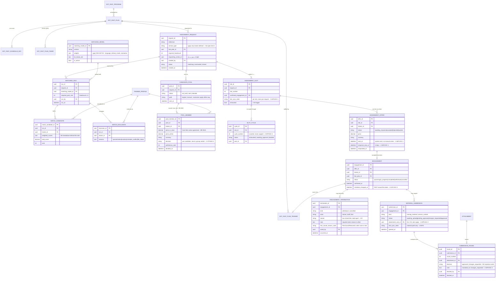

---

### 3.8 CAP-06 — entitlements

> **Implementation note (2026-09-01, `P-196`):** migration 11 builds both
> tables below **except `ENTITLEMENT.linkage_complete`**, which is annotated
> DERIVED here and is therefore not a column: it is computed from the three
> ids by `EntitlementLinkage.Resolve` on every read, so a chain that changes
> after the row was written cannot leave a stale `true` behind. Two further
> notes. `EXT_ERP_PURCHASE_ORDER` also carries **`currency`** — the block
> below omits it while `ENTITLEMENT` requires one, and an amount without its
> currency is not a fact; read the omission as a transcription gap. And
> `agreement_id`/`engagement_id` are **nullable**, because that is exactly
> what `BR-0603` is about: hop 2 resolves from the trainer's active agreement,
> hop 3 only from an engagement ERP names — which, per `Q39`, it currently
> never does.

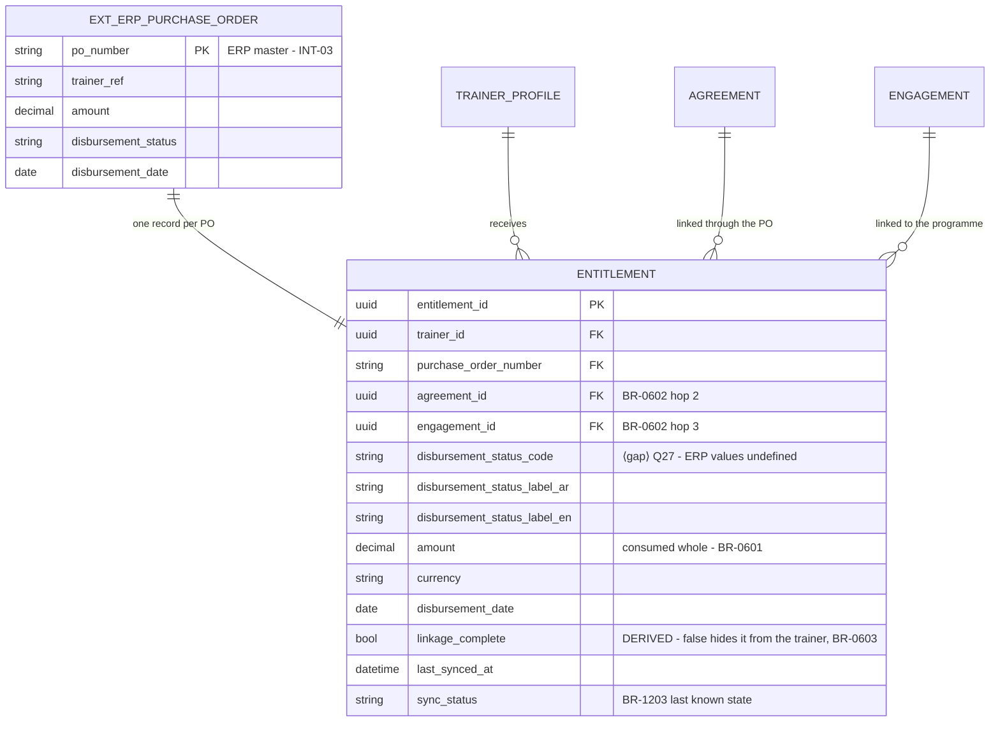

---

### 3.9 CAP-07 — notifications and deadlines

The matrix and SLA **tables** are buildable now; their **rows** are `DM-GAP-08`
and `DM-GAP-10`. `SLA_INSTANCE` is the live countdown on one specific record —
what every P-J4 badge in the frontend renders.

⚠️ **Corrected 2026-08-27 (P-147):** `NOTIFICATION_MATRIX_ROW` previously carried
a `channel` column annotated *"email AND in-platform together"*. A column whose
only legal value is "both" is not a column — `BR-0702` leaves nothing to choose,
so it is removed. Channel lives on `NOTIFICATION_LOG`, where it records what
actually happened, and where one channel can fail while the other succeeds.

⚠️ **`SLA_MATRIX_ROW.duration` is nullable in two distinct ways** (P-150/P-151),
and the frontend contract models both: a deadline may be **record-derived** —
J-12's agreement expiry follows the agreement's own term, and only the 90/30/5
reminder schedule is central — or its duration may simply be **undefined**,
which is `DM-GAP-10` for that row. A single nullable number cannot tell those
apart, and treating them alike would either invent a duration or discard an
approved rule.

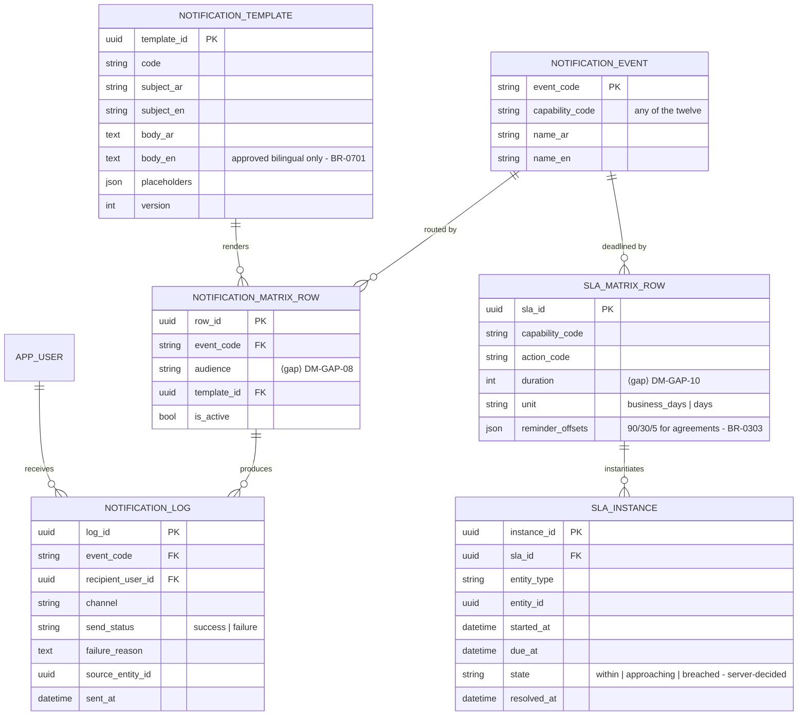

---

### 3.10 CAP-09 — analytics

**Owns no source data** (§8.9.1). It stores definitions and reads everything else.

> **Implementation note (2026-09-02, `P-198`):** migration 12 builds
> `METRIC_DEFINITION`, `DASHBOARD` and `DASHBOARD_METRIC`. **`REPORT_DEFINITION`
> and `REPORT_RUN` are NOT built** — `F-0905`'s export half has no service
> contract, no screen and no definitions (`Q26` supplies neither reports nor
> parameters), so a table with no reader and no writer would be the dead entry
> `P-123` warns about; same handling as CAP-05's `EXT_FAST_*` mirrors.
> `DASHBOARD` also carries **`feature_code`**, so the row and the gate that
> opens it agree. ⚠️ **`METRIC_DEFINITION.formula` is null on every seeded
> row** and the computation lives in `MetricRegistry`, keyed by `code`: §8.9
> writes no formulas, so there is nothing to interpret — that column is where
> they go when `Q26` answers.

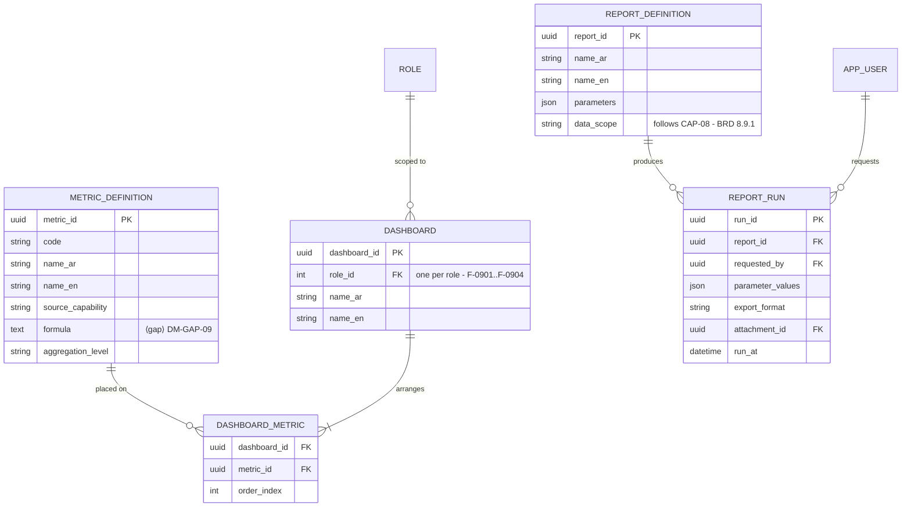

---

### 3.11 CAP-10 — public presence

`PUBLIC_PROFILE` is a **projection gated by consent**, and its field list is
exhaustive (J-24/F2/AC-1) — there is nowhere to put a field the journey does not
name.

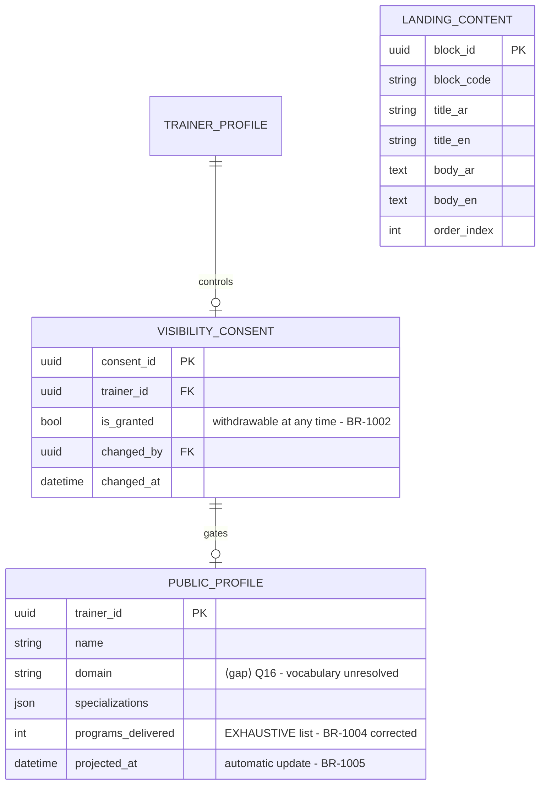

---

### 3.12 CAP-12 — integration governance and replication

`REPLICATION_STATE` is what makes entity-level mastership (§1.1) operable: one
row per shared entity instance, recording which side is master and when the two
last agreed.

> **Implementation note (2026-08-30, `P-183`):** migration 03 builds these four
> tables **plus `OUTBOX_MESSAGE`** — the transactional outbox `08` §4.2 rule 3
> mandates, which this ERD never drew: `(system_code, element_name, entity_type,
> entity_id, entity_version, operation, payload, idempotency_key UNIQUE, status
> pending|published, attempt_count, next_attempt_at, last_error, created_at,
> published_at)`. `INTEGRATION_LOG` is append-only, enforced the same way as
> `AUDIT_LOG`.

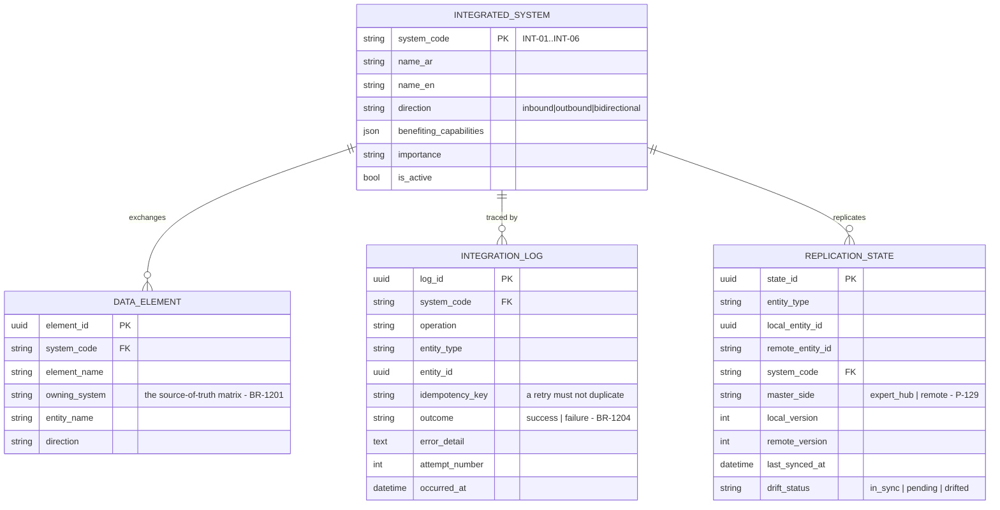

---

## 4. Source-of-truth matrix

From §8.12.4, extended to every entity group. **This table decides what the
database may author.**

| Data | Owner | Expert Hub holds | Rule |
|---|---|---|---|
| User identity | **Academy site** (INT-01) | A reference. No credential | `BR-1205` |
| Trainee evaluation (raw) | **MTM** (INT-02) | A permanent, immutable record | `02D` §1 |
| Calculated rating indicators | **Expert Hub** | Owned outright | `02D` §1 |
| Disbursement status / amount / date | **ERP** (INT-03) | A mirror per PO, never editable | `BR-0601`, `BR-1206` |
| Programme execution (enrolment, scheduling) | **FAST** (INT-05) | A reference + display cache | §8.12.4 |
| **Trainer profile data shown in FAST** | **Expert Hub** | Owned, **published outbound to FAST** | §8.12.4 |
| Agreement document content | **Prepared outside the platform** | Upload + link + status only | §9.2 |
| Everything in §9.3 | **Expert Hub** | Owned outright | §9.3 |

---

## 5. Integration points — where each one crosses

| | System | Direction | Trigger | Data | Writes / reads |
|---|---|---|---|---|---|
| **INT-01** | Academy site | ⇄ | Login; entry links | Identity, navigation | Reads → `APP_USER`. `BR-1205`: no credential stored |
| **INT-02** | MTM | ← in | Evaluation submitted | Raw ratings, scale, instructor, programme | Writes `RATING_SOURCE_RECORD`; **never FAST-mediated** (J-21/F6/AC-2) |
| **INT-03** | ERP | ← in | Disbursement processed | PO no., amount, status, date, trainer | Writes `ENTITLEMENT`; recomputes `linkage_complete` |
| **INT-04** | Email gateway | → out | Any matrix event | Recipient, rendered template, status | Reads `NOTIFICATION_MATRIX_ROW`; writes `NOTIFICATION_LOG` |
| **INT-05a** | FAST | ← in | Plan/programme read; execution updates | Plan, programme, schedule, **enrolment + attendance** | Populates `EXT_FAST_*` references. ⚠️ `PlanTaker` **not supplied** (`Q20`) |
| **INT-05b** | FAST | → out | Engagement confirmed | Accredited trainer, `PlanTrainer.TrainerId` | Expert Hub is the owner here (§8.12.4) |

Every one of the six writes `INTEGRATION_LOG` (`BR-1204`), and every one must
survive failure by keeping the last known state (`BR-1203`).

---

## 6. Cross-cutting requirements

- **Audit immutability** — `AUDIT_LOG` is append-only; §8.8.2 calls it «غير قابل
  للتعديل». No update or delete path exists.
- **Bilingual by default** — every user-facing name/label is a pair
  (`*_ar` / `*_en`). FAST already models it this way (`NameAr`/`NameEn`,
  `BriefAr`/`BriefEn`).
- **Soft-delete / retention** — blocked on `DM-GAP-15`; no archival strategy is
  assumed here.
- **Last-known-state** — `last_synced_at` + `sync_status` on every mirrored
  entity (`BR-1203`).

---

## 7. What still blocks the field lists

The entities and relationships above stand. **Columns cannot be finalised** for
these until the input arrives:

| Input | Blocks |
|---|---|
| `DM-GAP-01` | `APPLICATION_FIELD_VALUE`, `ATTACHMENT` rules |
| `DM-GAP-02` | `SCREENING_RESULT` scoring columns |
| `DM-GAP-03` | `INTERVIEW_EVALUATION.axis_scores` |
| `DM-GAP-05` | `POOL_MEMBER` weights and tie-breaking |
| `DM-GAP-06` | `ASSIGNMENT_REQUEST` field set |
| `DM-GAP-07` | `PERMISSION`, `ROLE_PERMISSION`, `USER_ROLE.scope_ref` |
| `DM-GAP-08` | `NOTIFICATION_MATRIX_ROW` rows |
| `DM-GAP-09` | CAP-09 metric definitions (no storage of its own) |
| `DM-GAP-10` | `SLA_MATRIX_ROW` rows |
| `DM-GAP-14` | `TRAINER_RATING` calculation rules |
| `DM-GAP-15` | Retention / archival across every entity |
| `Q20` | `EXT_FAST_PLAN_TAKER` — enrolment **and** attendance |
| `Q21` | 19 `lookup.*` value lists |
| `Q27` | `ENTITLEMENT.disbursement_status` values |
| `Q28` | `AI_ANALYSIS.provider_ref` — the AI provider is not a registered integration |

---

## 8. Next steps

1. **Confirm the two ownership calls in §1.2 and §4** — especially that Expert
   Hub owns the trainer data FAST displays, and that MTM records are permanent
   rather than cache. Both change the schema materially.
2. **Settle `DM-GAP-07`** (roles/permissions) — it gates `USER_ROLE.scope_ref`,
   which the *منسق مركز* restriction depends on, and CAP-08 is the recommended
   next build.
3. **Ask FAST for `PlanTaker`** (`Q20`) — the only entity in §3.5 with no
   definition at all.
4. Then: physical schema per capability, in the build order in
   [`14_INTERNAL_DASHBOARD_BRD_REVIEW.md`](14_INTERNAL_DASHBOARD_BRD_REVIEW.md) §3.
